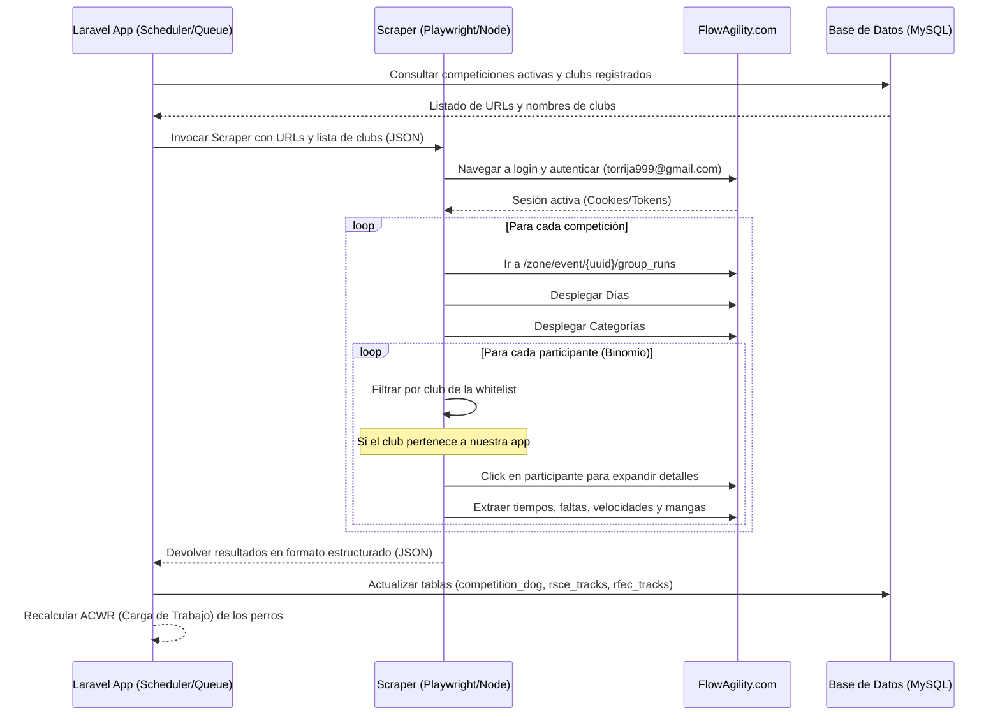

# Plan de Conexión y Web Scraping: FlowAgility.com

Este documento detalla el plan y análisis técnico para realizar la extracción automatizada (web scraping) de resultados de competiciones desde la plataforma **FlowAgility.com** para integrarlos en nuestra aplicación **AgilityAsturias**.

---

## 🔑 Credenciales de Acceso

Para realizar la autenticación y poder acceder a los datos de la zona privada de eventos en la plataforma, utilizaremos las siguientes credenciales:

> [!IMPORTANT]
> **Usuario:** `torrija999@gmail.com`  
> **Contraseña:** `torrijaia`

---

## 📐 Flujo de Datos y Arquitectura de Integración

El scraping se estructurará como una tarea asíncrona en el backend de nuestra aplicación (Laravel) que ejecutará un script en segundo plano para realizar las acciones en el navegador.



---

## 🗄️ Relación con Modelos y Tablas de la Base de Datos

Analizando la estructura de la base de datos de **AgilityAsturias**, realizaremos las siguientes interacciones:

1. **Competiciones de Origen:**
   - Buscaremos en la tabla `competitions` (representada por el modelo [Competition](file:///c:/Users/Fonsi/Desktop/AgilityAsturias/agility_back/app/Models/Competition.php)) aquellos registros cuyo campo `enlace` (Enlace de Inscripción) pertenezca a FlowAgility.
   - Ejemplo de conversión de enlace:
     - URL Inscripción: `https://www.flowagility.com/zone/events/info/b6a5b896-93bb-4b12-9344-cfb41c52fe65`
     - URL Scraping: `https://www.flowagility.com/zone/event/b6a5b896-93bb-4b12-9344-cfb41c52fe65/group_runs`
     - *Regla de conversión:* Reemplazar `events/info` por `event` y añadir `/group_runs` al final.

2. **Whitelist de Clubs:**
   - Para no expandir ni procesar innecesariamente a todos los competidores de la prueba, consultaremos los clubs registrados en nuestra aplicación desde el modelo [Club](file:///c:/Users/Fonsi/Desktop/AgilityAsturias/agility_back/app/Models/Club.php) (ej. `Agility Asturias`, etc.).
   - Solo si el nombre o el slug del club del competidor coincide con nuestra lista, procederemos a desplegar sus detalles.

3. **Asociación del Binomio (Guía y Perro):**
   - Buscaremos el perro en la tabla `dogs` (modelo [Dog](file:///c:/Users/Fonsi/Desktop/AgilityAsturias/agility_back/app/Models/Dog.php)) mediante su nombre (campo `name`) y validando el nombre del guía/dueño (tabla `users` mediante la relación de pertenencia de [Dog](file:///c:/Users/Fonsi/Desktop/AgilityAsturias/agility_back/app/Models/Dog.php) con [User](file:///c:/Users/Fonsi/Desktop/AgilityAsturias/agility_back/app/Models/User.php) a través de la tabla `dog_user`).

4. **Persistencia de Resultados y Tracks:**
   - Registraremos la asistencia general y clasificación final en la tabla pivote `competition_dog` (guardando el `position` final).
   - Dependiendo del tipo de federación de la competición (`competitions.federacion` que es un enum `['RSCE', 'RFEC', 'Otro']`), guardaremos los resultados de las mangas:
     - Si es **RSCE**: Insertaremos en la tabla `rsce_tracks` (modelo [RsceTrack](file:///c:/Users/Fonsi/Desktop/AgilityAsturias/agility_back/app/Models/RsceTrack.php)).
     - Si es **RFEC**: Insertaremos en la tabla `rfec_tracks` (modelo [RfecTrack](file:///c:/Users/Fonsi/Desktop/AgilityAsturias/agility_back/app/Models/RfecTrack.php)).

---

## 🛠️ Especificación Técnica del Scraper

Dado que FlowAgility es una SPA (Single Page Application) con comportamiento dinámico y asíncrono, **descartamos el uso de simples peticiones HTTP (curl/Guzzle)** y recomendamos el uso de un navegador headless para garantizar que el DOM esté completamente renderizado.

### 📋 Herramienta recomendada: Node.js + Playwright o Puppeteer
Recomendamos crear un script en Node.js utilizando **Playwright** debido a su velocidad, excelente gestión de esperas asíncronas y capacidad para resolver problemas de concurrencia. El script se guardará en la carpeta backend y se llamará desde un comando Artisan.

### 📝 Datos que podemos extraer de cada manga/participante:

| Campo FlowAgility | Destino en BD | Tipo de Dato | Notas / Mapeo |
| :--- | :--- | :--- | :--- |
| **Nombre Guía** | Relación Guía | `string` | Se usa para verificar que el perro coincide con el usuario en nuestra app. |
| **Nombre Perro** | `dog_id` | `foreignId` | Clave foránea al ID del perro en `dogs`. |
| **Puesto General** | `competition_dog.position` | `string` | Puesto final general de la prueba. |
| **Nombre de Manga** | `manga_type` | `string` | "Agility" (Manga 1), "Jumping" (Manga 2), etc. |
| **Velocidad** | `speed` | `decimal(4,2)` | En m/s (ej: `4.52`). |
| **Calificación** | `qualification` | `string` | Excelente (EXC), Muy Bueno (MB), Bueno (B), Satisfecho (SAT), No Calificado (NC), Eliminado (ELIM/DISQ). |
| **Tiempos y Penalización** | `notes` | `text` | JSON o string descriptivo con los detalles (`T: 32.1s, Faltas: 1, Rehuses: 0, Penaliz: 5.0`). |
| **Juez de la prueba** | `judge_name` | `string` | Juez que calificó la manga. |
| **Fecha de la manga** | `date` | `date` | Parseado a partir del día del evento. |

---

## ⚙️ Código Prototipo del Scraper (Playwright JS)

A continuación se muestra una plantilla del script de Node.js `flowagility_scraper.js` que implementa el flujo:

```javascript
const { chromium } = require('playwright');
const fs = require('fs');

(async () => {
    // Recibe argumentos desde Laravel: clubs whitelisted y URLs de competiciones
    const args = process.argv.slice(2);
    const config = JSON.parse(args[0]); // { clubs: ['Agility Asturias'], events: [{ id: 1, url: '...' }] }

    const browser = await chromium.launch({ headless: true });
    const page = await browser.newPage();

    console.log("Iniciando sesión en FlowAgility...");
    await page.goto('https://www.flowagility.com/zone/login'); // O URL de login exacta
    await page.fill('input[type="email"]', 'torrija999@gmail.com');
    await page.fill('input[type="password"]', 'torrijaia');
    await page.click('button[type="submit"]');
    await page.waitForNavigation();
    
    const results = [];

    for (const event of config.events) {
        console.log(`Procesando evento: ${event.url}`);
        await page.goto(event.url);
        await page.waitForSelector('.runs-container', { timeout: 10000 }); // Ajustar al selector real

        // 1. Obtener y expandir días de competición
        const dayButtons = await page.$$('.day-selector-btn'); // Ajustar selector
        for (let i = 0; i < dayButtons.length; i++) {
            await dayButtons[i].click();
            await page.waitForTimeout(1000); // Esperar carga de categorías

            // 2. Obtener y expandir categorías del día
            const categoryHeaders = await page.$$('.category-header'); // Ajustar selector
            for (let j = 0; j < categoryHeaders.length; j++) {
                await categoryHeaders[j].click();
                await page.waitForTimeout(1000);

                // 3. Obtener participantes en la categoría
                const participants = await page.$$('.participant-row'); // Ajustar selector
                for (const participant of participants) {
                    const clubNameText = await participant.$eval('.club-name', el => el.innerText.trim());
                    
                    // Comprobar si el club del participante está en la whitelist
                    const isOurClub = config.clubs.some(c => 
                        clubNameText.toLowerCase().includes(c.toLowerCase())
                    );

                    if (isOurClub) {
                        // 4. Click en el participante para ver detalles y mangas
                        await participant.click();
                        await page.waitForSelector('.runs-detail', { timeout: 5000 });

                        const dogName = await participant.$eval('.dog-name', el => el.innerText.trim());
                        const handlerName = await participant.$eval('.handler-name', el => el.innerText.trim());
                        const position = await participant.$eval('.overall-position', el => el.innerText.trim());

                        // Extraer mangas
                        const runElements = await participant.$$('.run-row');
                        const runs = [];
                        for (const run of runElements) {
                            const mangaType = await run.$eval('.manga-title', el => el.innerText.trim());
                            const time = await run.$eval('.run-time', el => el.innerText.trim());
                            const speed = await run.$eval('.run-speed', el => el.innerText.trim());
                            const faults = await run.$eval('.run-faults', el => el.innerText.trim());
                            const refusals = await run.$eval('.run-refusals', el => el.innerText.trim());
                            const qualification = await run.$eval('.run-qualification', el => el.innerText.trim());
                            const judge = await run.$eval('.run-judge', el => el.innerText.trim());

                            runs.push({
                                mangaType,
                                time,
                                speed,
                                faults,
                                refusals,
                                qualification,
                                judge
                            });
                        }

                        results.push({
                            eventId: event.id,
                            dogName,
                            handlerName,
                            clubName: clubNameText,
                            position,
                            runs
                        });
                    }
                }
            }
        }
    }

    // Retornar resultados en formato JSON para que Laravel los capture
    console.log(JSON.stringify(results));
    await browser.close();
})();
```

---

## 🔗 Integración con Laravel (Cola de Trabajos y Artisan)

Para integrar este script de forma limpia y automatizada dentro del backend Laravel:

1. **Crear Comando Artisan para Scraping (`ScrapeFlowAgility.php`):**
   Este comando recupera la whitelist de clubs, obtiene las competiciones que tienen enlaces válidos de FlowAgility, e invoca el script de Node.js mediante el componente `Symfony\Component\Process\Process`.

2. **Crear un Job en la Cola (`ProcessScrapeResults.php`):**
   El comando Artisan se ejecutará de forma asíncrona mediante un Job en cola (utilizando la base de datos como driver de cola que ya está configurado en `.env` bajo `QUEUE_CONNECTION=database`).

### Prototipo de Comando Artisan (`app/Console/Commands/ScrapeFlowAgility.php`)

```php
<?php

namespace App\Console\Commands;

use Illuminate\Console\Command;
use Symfony\Component\Process\Process;
use App\Models\Competition;
use App\Models\Club;
use App\Models\Dog;
use App\Models\RsceTrack;
use App\Models\RfecTrack;
use Illuminate\Support\Facades\DB;

class ScrapeFlowAgility extends Command
{
    protected $signature = 'flowagility:scrape';
    protected $description = 'Scrapes results from FlowAgility for active competitions and syncs them to the DB';

    public function handle()
    {
        // 1. Obtener la whitelist de nombres de clubs de nuestra base de datos
        $clubs = Club::pluck('name')->toArray();

        // 2. Obtener competiciones con enlace de FlowAgility
        $competitions = Competition::where('enlace', 'LIKE', '%flowagility.com/zone/events/info/%')
            ->select('id', 'enlace', 'federacion', 'lugar')
            ->get()
            ->map(function ($comp) {
                // Convertir la URL al formato de scraping de group_runs
                $uuid = basename($comp->enlace);
                return [
                    'id' => $comp->id,
                    'url' => "https://www.flowagility.com/zone/event/{$uuid}/group_runs",
                    'federacion' => $comp->federacion,
                    'location' => $comp->lugar
                ];
            });

        if ($competitions->isEmpty()) {
            $this->info("No hay competiciones con enlaces de FlowAgility para scrapear.");
            return 0;
        }

        // 3. Preparar argumentos JSON
        $config = json_encode([
            'clubs' => $clubs,
            'events' => $competitions->toArray()
        ]);

        // 4. Ejecutar el script Node con Playwright
        $process = new Process(['node', base_path('flowagility_scraper.js'), $config]);
        $process->setTimeout(600); // 10 minutos max
        $process->run();

        if (!$process->isSuccessful()) {
            $this->error("Error al ejecutar el scraper: " . $process->getErrorOutput());
            return 1;
        }

        // 5. Procesar los resultados obtenidos
        $scrapedData = json_decode($process->getOutput(), true);
        if (empty($scrapedData)) {
            $this->info("No se encontraron resultados relevantes de clubs locales.");
            return 0;
        }

        foreach ($scrapedData as $entry) {
            $this->syncResultToDatabase($entry, $competitions);
        }

        $this->info("Sincronización con FlowAgility finalizada con éxito.");
        return 0;
    }

    private function syncResultToDatabase($entry, $competitions)
    {
        // Encontrar perro y guía correspondientes en la BD
        $dog = Dog::where('name', $entry['dogName'])
            ->whereHas('users', function ($query) use ($entry) {
                $query->where('name', 'LIKE', '%' . $entry['handlerName'] . '%');
            })
            ->first();

        if (!$dog) {
            $this->warn("No se encontró el perro '{$entry['dogName']}' con el guía '{$entry['handlerName']}' en nuestra base de datos. Saltando...");
            return;
        }

        $compInfo = collect($competitions)->firstWhere('id', $entry['eventId']);

        // Sincronizar en la tabla de asistencia de competiciones
        $dog->competitions()->syncWithoutDetaching([
            $entry['eventId'] => [
                'position' => $entry['position'],
                // Podemos asignar el primer propietario si es necesario
                'user_id' => $dog->users()->first()?->id
            ]
        ]);

        // Procesar e insertar las mangas según la federación
        foreach ($entry['runs'] as $run) {
            $trackData = [
                'dog_id' => $dog->id,
                'date' => now(), // Idealmente parseado del día del scraper
                'manga_type' => $run['mangaType'],
                'qualification' => $this->mapQualification($run['qualification']),
                'speed' => floatval($run['speed']),
                'judge_name' => $run['judge'] ?: $compInfo['judge_name'] ?? null,
                'location' => $compInfo['location'],
                'notes' => "Faltas: {$run['faults']}, Rehuses: {$run['refusals']}, Tiempo: {$run['time']}s",
                'club_id' => $dog->club_id,
            ];

            if ($compInfo['federacion'] === 'RSCE') {
                RsceTrack::updateOrCreate(
                    [
                        'dog_id' => $dog->id,
                        'date' => $trackData['date'],
                        'manga_type' => $trackData['manga_type']
                    ],
                    $trackData
                );
            } elseif ($compInfo['federacion'] === 'RFEC') {
                $trackData['grade'] = $dog->rfec_grade; // Grado actual del perro
                RfecTrack::updateOrCreate(
                    [
                        'dog_id' => $dog->id,
                        'date' => $trackData['date'],
                        'manga_type' => $trackData['manga_type']
                    ],
                    $trackData
                );
            }
        }
        
        // Disparar recálculo de ACWR para el perro
        $dog->calculateAcwrData(); 
    }

    private function mapQualification($flowQual)
    {
        // Normalización de calificaciones de FlowAgility a nuestro estándar
        $q = strtoupper(trim($flowQual));
        if (str_contains($q, 'EXC') || str_contains($q, 'EXCELENTE')) return 'Excelente';
        if (str_contains($q, 'MB') || str_contains($q, 'MUY BUENO')) return 'Muy Bueno';
        if (str_contains($q, 'B') || str_contains($q, 'BUENO')) return 'Bueno';
        if (str_contains($q, 'SAT') || str_contains($q, 'SATISFECHO')) return 'Satisfecho';
        if (str_contains($q, 'ELIM') || str_contains($q, 'DISQ')) return 'Eliminado';
        return 'No Calificado';
    }
}
```

---

## ⚠️ Retos y Consideraciones del Scraping

1. **Dependencia del DOM de FlowAgility:**
   Los scripts de web scraping con navegadores headless son vulnerables a cambios en las clases y estructura HTML del sitio objetivo. Si FlowAgility actualiza su diseño, el script podría fallar.
   - *Solución:* Incluir un manejo robusto de excepciones y alertas por correo o Slack cuando el scraper no encuentre los selectores esenciales, para corregirlo rápidamente.

2. **Detección de Bots y Bloqueos:**
   FlowAgility podría implementar medidas anti-bot (Cloudflare, recaptcha).
   - *Solución:* Playwright permite configurar agentes de usuario realistas (`User-Agent`), deshabilitar flags de automatización (usando `stealth` plugins) e introducir retardos aleatorios entre interacciones para imitar el comportamiento humano.

3. **Mapeo de Nombres (Guías y Perros):**
   Las erratas o diferencias tipográficas en los nombres (p. ej. `María Gómez` en nuestra app y `Maria Gomez` en FlowAgility, o un perro registrado como `Thor` y en FlowAgility como `Thor de AgilityAsturias`) pueden impedir la correcta asociación.
   - *Solución:* Implementar comparación con tolerancia (insensible a mayúsculas/minúsculas y acentos) o utilizar funciones de similitud de cadenas (como la distancia Levenshtein) para sugerir emparejamientos en un panel de administración en caso de dudas.
