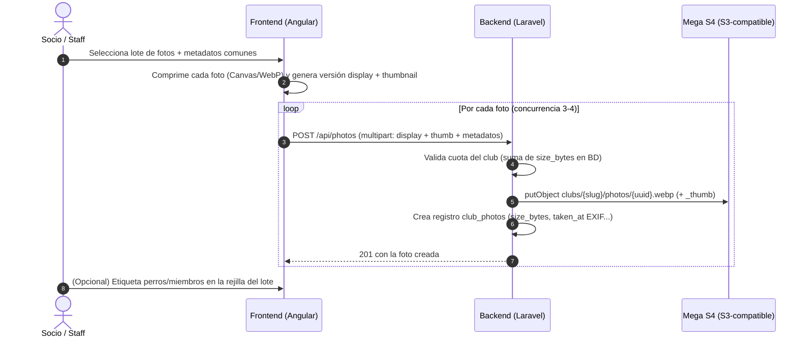

# 📸 Galería de Fotos Interna del Club

Especificación de la nueva funcionalidad de **galería de fotos interna** por club, hermana de la videoteca (ver [[gestion-videos]]). Permite a socios y staff subir fotografías que se comprimen en el navegador y se almacenan en **Mega S4** (almacenamiento S3-compatible ya configurado en el backend), con etiquetado de perros y miembros, clasificación por categorías y cuota de almacenamiento según el plan de suscripción del club.

> [!NOTE] Diferencia con la galería pública existente
> No confundir con el modelo `GalleryImage` actual, que alimenta la galería de la **landing pública** del club (ver [[presencia-publica]]). Esta funcionalidad es una **fototeca interna** para miembros autenticados (aislada por tenant, ver [[arquitectura-multi-tenant]]). Como extensión futura, una foto interna podrá "promocionarse" a la galería pública (equivalente al flag `in_public_gallery` de los vídeos).

---

## 🎯 1. Objetivo y Casos de Uso

En el mundo del agility las fotos llegan **a ráfagas**: tras un fin de semana de competición, un fotógrafo aficionado del club vuelve con 50–200 fotos; tras un seminario, alguien comparte 30. El caso de uso dominante **no es** subir una foto suelta, sino **volcar un lote** de un mismo evento. Toda la UX se diseña alrededor de esto:

- **Subida en lote** con metadatos comunes (mismo evento → misma categoría, competición y fecha).
- **Mínimos campos obligatorios** en el momento de subir; el detalle fino (etiquetar perros/personas, tipo de foto) se puede completar **después**, incluso por otros miembros.
- Navegación/filtrado por categoría, competición, perro, miembro y tipo de foto.

---

## 🗂️ 2. Clasificación de las Fotos

### A. Categoría (obligatoria — 1 clic)

| Categoría | Descripción |
| :--- | :--- |
| **Entrenamiento** | Sesiones y clases habituales en el club. |
| **Competición** | Pruebas oficiales o sociales. Al elegirla se despliega el selector de competición. |
| **Seminario / Taller** | Stages, workshops y formaciones con técnicos invitados. |
| **Evento social** | Quedadas, comidas, celebraciones, aniversarios del club. |
| **Cachorros y nuevos miembros** | Presentaciones de nuevas incorporaciones (muy compartibles, alto valor emocional). |
| **Instalaciones y pistas** | Fotos de la pista, obstáculos, montajes de recorridos, mejoras del club. |
| **Otros** | Cajón de sastre. |

- Si **Categoría = Competición**, aparece un desplegable **obligatorio** con las competiciones pasadas y actuales guardadas en base de datos — exactamente el mismo patrón y fuente de datos (`pastAndCurrentCompetitions`) que el formulario de subida de vídeos.
- Para el resto de categorías el selector de competición permanece oculto.

### B. Tipo de foto (opcional)

| Tipo | Descripción |
| :--- | :--- |
| **Podio** | Entrega de premios, perro/guía en el cajón. Filtro estrella para revivir éxitos. |
| **Perro en acción** | El perro saltando, en slalom, en zona de contacto… |
| **Binomio** | Guía y perro juntos (posado o en pista). |
| **Foto de grupo** | El equipo del club, foto de familia del evento. |
| **Retrato** | Primer plano del perro (o del guía). |
| **Ambiente / Backstage** | Boxes, carpas, preparativos, momentos entre mangas. |
| **Otras** | Resto de casos. |

### C. Evaluación de los campos propuestos

**Veredicto: los campos planteados (categoría, competición condicional y tipo de foto) son suficientes. No conviene añadir más.** Razonamiento:

- Cada campo obligatorio multiplica la fricción **× N fotos del lote**. Con vídeos se sube 1 archivo y rellenar 4 campos es asumible; con 80 fotos no lo es.
- La categoría responde a "¿de qué evento es?" y el tipo a "¿qué se ve?". Son ejes ortogonales y juntos cubren todos los filtros útiles de navegación.
- Campos **descartados conscientemente**:
  - *Ubicación*: redundante (la competición ya tiene sede; los entrenamientos son en el club).
  - *Manga / grado / nivel*: tiene sentido en vídeo (se analiza el recorrido, ver [[analisis-videos-insights]]), pero en foto no aporta y encarece la subida.
  - *Descripción larga*: un **título/pie de foto opcional** de una línea basta.

### D. Resumen de obligatoriedad

| Campo | Obligatorio | Momento | Notas |
| :--- | :---: | :--- | :--- |
| Archivo(s) | ✅ | Subida | JPG, PNG, WebP, HEIC. Selección múltiple y drag & drop. |
| Categoría | ✅ | Subida (común al lote) | 1 clic. |
| Competición | ✅ *solo si* categoría = Competición | Subida (común al lote) | Desplegable desde BD, igual que en vídeos. |
| Fecha | ✅ (autorrellena) | Subida (común al lote) | Se extrae de los metadatos **EXIF** de la primera foto; editable; fallback: hoy. |
| Tipo de foto | ⬜ Opcional | Subida o después | Editable por foto desde la galería. |
| Perros etiquetados | ⬜ Opcional | Subida o después | Multi-selección con el mismo selector 🐾/🦴 de la videoteca. |
| Miembros etiquetados | ⬜ Opcional | Subida o después | Multi-selección de usuarios del club. |
| Título / pie de foto | ⬜ Opcional | Subida o después | Una línea. |

---

## 📤 3. Subida Múltiple (Decisión de Diseño Clave)

Subir fotos de una en una queda **descartado** como flujo principal. El equilibrio óptimo es un asistente en 2 pasos:

1. **Paso 1 — Lote y metadatos comunes:** el usuario arrastra o selecciona hasta **30 fotos** por lote. Rellena una sola vez los campos comunes (categoría, competición si procede, fecha). Botón "Subir".
2. **Paso 2 — Refinado opcional:** rejilla de miniaturas del lote recién subido donde, foto a foto y *si quiere*, asigna tipo de foto, etiqueta perros/miembros y pone título. Puede saltarse este paso por completo: las fotos ya están publicadas en la galería.

Detalles del flujo:

- **Compresión en cliente** antes de subir (ver §4): se sube ya comprimido, así el lote de 80 MB de fotos de móvil viaja como ~10 MB.
- **Subida con concurrencia limitada** (3–4 ficheros en paralelo) y barra de progreso global + estado por miniatura (pendiente / subiendo / ✅ / ❌ con reintento individual). Un fallo en una foto **no aborta el lote**.
- **Límites:** máx. 30 fotos por lote y 20 MB por foto original (antes de comprimir). Si el club supera su cuota a mitad de lote, se detiene la subida e informa de cuáles entraron.
- **Etiquetado colaborativo posterior:** cualquier socio puede etiquetar perros/miembros en cualquier foto desde la vista de detalle (mismo espíritu comunitario que la validación colaborativa de [[analisis-videos-insights]]). El autor de la foto, el staff y el etiquetado pueden retirar etiquetas.

---

## ⚙️ 4. Pipeline Técnico: Compresión + Mega S4

### Compresión en cliente
- Se **extiende** el `ImageCompressorService` existente del frontend (hoy fijado a 800px para logos) parametrizando dimensiones y calidad. Por cada original se generan **dos versiones**:
  - **Display:** lado mayor 1920 px, WebP calidad 0.8 → ~300–500 KB. Suficiente para pantalla completa en móvil y escritorio.
  - **Thumbnail:** lado mayor 400 px, WebP → ~30–50 KB. Para la rejilla de la galería.
- El original **no se conserva** (es lo que hace sostenible la cuota). Se comunica claramente en la UI: "la galería optimiza tus fotos para web".
- La fecha de captura se lee del **EXIF antes de comprimir** (la compresión por canvas descarta los metadatos, lo cual además es deseable para privacidad: se elimina el GPS).

### Almacenamiento en Mega S4
- Se reutilizan las credenciales ya existentes en `config/services.php` (`mega_s4.*`) mediante un disco Flysystem S3 (`league/flysystem-aws-s3-v3`) apuntando a `s4.mega.io`.
- Ruta de objetos: `clubs/{slug}/photos/{uuid}.webp` y `clubs/{slug}/photos/{uuid}_thumb.webp`.
- **Lección aprendida del prototipo Bitmovin** (ver [[gestion-videos]] §4): Mega S4 no soporta la cabecera `x-amz-acl` ni ofrece CORS configurable, por lo que **no se sirven los objetos en directo al navegador**. La entrega se hace mediante **URLs prefirmadas (presigned GET)** generadas por el backend con caducidad de ~1h, o en su defecto un endpoint proxy `/api/photos/{id}/file` con caché HTTP. Primera opción preferida: no consume ancho de banda del servidor.
- **Borrado:** el modelo `ClubPhoto` intercepta el evento `deleting` y elimina ambos objetos de Mega (mismo patrón que `Video.php` con Bunny). El borrado en cascada del club (safe delete) incluye sus fotos.

### Modelo de datos (resumen)
- Tabla `club_photos`: `id, club_id, user_id (autor), competition_id (nullable), category, photo_type (nullable), title (nullable), taken_at, path, thumb_path, size_bytes, is_public, created_at...` — con `TenantScope` vía trait `HasClub`.
- Pivotes `club_photo_dog` y `club_photo_user` para el etiquetado múltiple.
- La **cuota usada se calcula con `SUM(size_bytes)` en base de datos** (instantáneo y sin llamadas externas, a diferencia del cálculo cacheado contra la API de Bunny en vídeos).

---

## 💾 5. Cuota de Almacenamiento por Plan (Propuesta)

Con fotos de ~0,55 MB de media (display + thumb), la cuota se dimensiona así (nuevo campo `photo_storage_limit_gb` en la tabla `plans`, análogo a `video_storage_limit_gb`):

| Plan | Cuota de fotos | Capacidad aproximada | Lectura para el club |
| :--- | :---: | :---: | :--- |
| **Básico** | **5 GB** | ~9.000 fotos | Años de uso para un club pequeño; la galería de fotos sí entra en Básico (a diferencia de los vídeos), porque es barata y aporta mucha vida a la app. |
| **Pro** | **25 GB** | ~45.000 fotos | Holgura total para clubes activos con fotógrafo habitual. |
| **Élite** | **100 GB** | ~180.000 fotos | Prácticamente ilimitado en la práctica; argumento comercial. |

Justificación de costes: Mega S4 cuesta en el orden de **2–3 €/TB/mes**, por lo que incluso la cuota Élite supone céntimos al mes por club. La cuota no existe para proteger el coste sino para **diferenciar planes** y evitar abusos (volcados de carretes enteros sin criterio). Ver [[planes-suscripcion-saas]].

Comportamiento al acercarse al límite (reutilizando el patrón de la videoteca):
- **≥ 90 %:** banner de aviso en el formulario de subida recomendando borrar fotos antiguas o subir de plan.
- **100 %:** el backend rechaza nuevas subidas con `403` y mensaje accionable.

---

## 🔒 6. Privacidad y Derechos de Imagen

- La galería es **interna**: solo miembros autenticados del tenant. Nada se expone públicamente salvo promoción explícita a la galería de la landing (futuro).
- El **etiquetado de personas** es un dato personal: todo miembro puede **quitarse una etiqueta** propia y solicitar al staff la retirada de una foto en la que aparezca. El staff y el responsable del club pueden eliminar cualquier foto.
- La compresión por canvas **elimina los metadatos EXIF** del fichero servido (incluido GPS), reduciendo la exposición de datos de localización de los miembros.
- Pendiente: añadir una línea sobre uso de imágenes en el consentimiento de alta del socio.

---

## 🛠️ 7. Referencia de Implementación

| Pieza | Ubicación |
| :--- | :--- |
| Modelo + borrado en Mega | `agility_back/app/Models/ClubPhoto.php` |
| Controlador (cuota, filtros, etiquetas) | `agility_back/app/Http/Controllers/PhotoController.php` |
| Migraciones | `2026_06_10_120000_create_club_photos_tables.php` y `2026_06_10_120100_add_photo_storage_limit_gb_to_plans_table.php` |
| Disco Flysystem | `config/filesystems.php` → disco `mega_s4`; selección vía `PHOTO_UPLOAD_DISK` (`public` por defecto, `mega_s4` en producción) |
| Rutas API | `GET/POST /api/photos`, `POST /api/photos/{id}`, `POST /api/photos/{id}/delete`, `POST /api/photos/{id}/untag-self`, `GET /api/photos/storage-stats` |
| Subida en lote (2 pasos) | `frontend/src/app/components/galeria-fotos/upload-photos/` |
| Galería + lightbox | `frontend/src/app/components/galeria-fotos/photo-list/` (rutas `/galeria-fotos` y `/galeria-fotos/subir`) |
| Lectura EXIF en cliente | `frontend/src/app/utils/exif-date.util.ts` |
| Tests | `agility_back/tests/Feature/ClubPhotoTest.php` |

## 🔮 8. Líneas Futuras

- **Promoción a galería pública:** checkbox para que el staff destaque fotos en la landing ([[presencia-publica]]), sustituyendo la gestión manual actual de `GalleryImage`.
- **Descarga del lote en ZIP** de un evento/competición.
- **Integración con gamificación:** una foto de podio etiquetada podría alimentar logros o cromos ([[gamificacion-stickers]]).
- **Pase de diapositivas** en pantallas del club durante eventos sociales.
