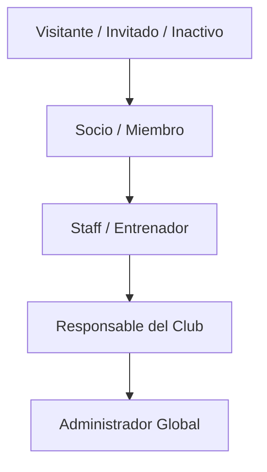

# Tipos de Usuarios y Roles en ClubAgility

Este documento describe en detalle las diferentes tipologías de usuarios que interactúan con la plataforma **ClubAgility**, sus permisos y el alcance de sus responsabilidades dentro del ecosistema multi-tenant.

---

## 👥 Resumen de Roles

La aplicación implementa un sistema de control de acceso basado en roles (RBAC). A continuación, se detallan los 5 perfiles del sistema de mayor a menor restricción de permisos:

---

## 1. 🌐 Visitante / Invitado / Inactivo
Representa al usuario que accede a la aplicación sin iniciar sesión (anónimo/invitado) o a un usuario registrado que se encuentra en estado inactivo (por ejemplo, de baja temporal o sin cuota/suscripción activa en el club). Su vista está limitada estrictamente a la presencia web exterior y pública de cada club.

*   **Alcance:**
    *   Visualizar la página de inicio (Landing Page) pública del club (lema, eslogan, horarios generales).
    *   Consultar la galería de fotografías públicas de entrenamientos y eventos.
    *   Ver la videoteca pública con los vídeos seleccionados por el Staff.
    *   Enviar solicitudes de información a través del formulario de contacto.

---

## 2. 🐕 Socio / Miembro
Es el perfil principal del deportista y socio del club. Cuenta con acceso a las herramientas operativas personales y de su perro.

*   **Alcance:**
    *   **Gestión de Manada:** Crear y editar las fichas de sus perros (resumen, datos de salud, documentación y compartir guías).
    *   **Monitor ACWR:** Registrar la carga de entrenamientos (minutos e intensidad) y visualizar el ratio de carga aguda/crónica para prevención de lesiones.
    *   **Reservas de Pistas:** Realizar reservas de franjas horarias libres y gestionar el calendario de asistencia.
    *   **Historial Deportivo:** Gestionar las marcas personales y competiciones en las bitácoras oficiales de la **RSCE** y la **RFEC** (ver [[normativa-rfec]]).
    *   **Gamificación:** Coleccionar stickers de los perros del club, abrir cofres, acumular monedas anti-frustración e intercambiar cromos repetidos con otros socios (ver [[gamificacion-stickers]]).
    *   **Multimedia:** Subir vídeos de sus entrenamientos, dar "Me gusta" en los vídeos del club y descargarlos de forma local (ver [[gestion-videos]]).

---

## 3. ⏱️ Staff / Entrenador
Es el perfil destinado a los monitores, entrenadores o miembros de la junta directiva encargados del día a día deportivo del club.

*   **Alcance:**
    *   *Todos los permisos de Socio.*
    *   **Gestión del Horario:** Modificar y programar las franjas de reservas (time slots) del calendario y establecer excepciones (bloqueo por lluvia o mantenimiento).
    *   **Puntos y Asistencia:** Validar oficialmente la asistencia de los socios a clase ("pasar lista") y otorgar puntos deportivos manuales para la clasificación interna.
    *   **Tablón de Anuncios:** Publicar, modificar o retirar anuncios y circulares para todos los socios con alertas de notificación interna.
    *   **Moderación Multimedia:** Decidir qué vídeos subidos por los socios son idóneos para aparecer en la galería y videoteca pública.

---

## ⚙️ 4. Responsable del Club
Es el perfil de gestión y responsabilidad sobre el club como negocio. Gestiona la identidad corporativa y la nómina de usuarios del tenant.

*   **Alcance:**
    *   *Todos los permisos de Staff.*
    *   **Configuración Visual (Theming):** Modificar el subdominio/slug, el logotipo y la paleta de colores corporativos del club que Angular inyecta dinámicamente como variables CSS (ver [[sistema-diseno]] y [[arquitectura-multi-tenant]]).
    *   **Control de Accesos:** Invitar a nuevos miembros generando enlaces de registro, habilitar/deshabilitar usuarios y gestionar los roles de Staff.
    *   **Onboarding:** Seguir el flujo en cascada del Checklist global de bienvenida para configurar y activar el club (ver [[estrategias-onboarding-ux]]).

---

## 🔑 5. Administrador Global (SaaS Admin)
Es el perfil técnico de soporte de la plataforma SaaS (desarrolladores y administradores generales del software).

*   **Alcance:**
    *   **Visibilidad Inter-Tenant:** Es el único rol capaz de sobrepasar el `TenantScope` para visualizar información cruzada de varios clubes o realizar cambios en toda la base de datos (ver [[arquitectura-multi-tenant]]).
    *   **CRUD de Clubes:** Dar de alta nuevos clubes, configurar bases de datos asociadas y asignar planes de precios SaaS (ver [[planes-suscripcion-saas]]).
    *   **Control de Scrapers:** Monitorizar en vivo el scraper de Playwright para FlowAgility (`AdminScraperMonitorComponent`), revisar trazas de error y forzar re-intentos de sincronización (ver [[integracion-flowagility]]).
    *   **Soporte Técnico:** Resolver incidencias de facturación y fallos de subida a servidores de almacenamiento como YouTube.
