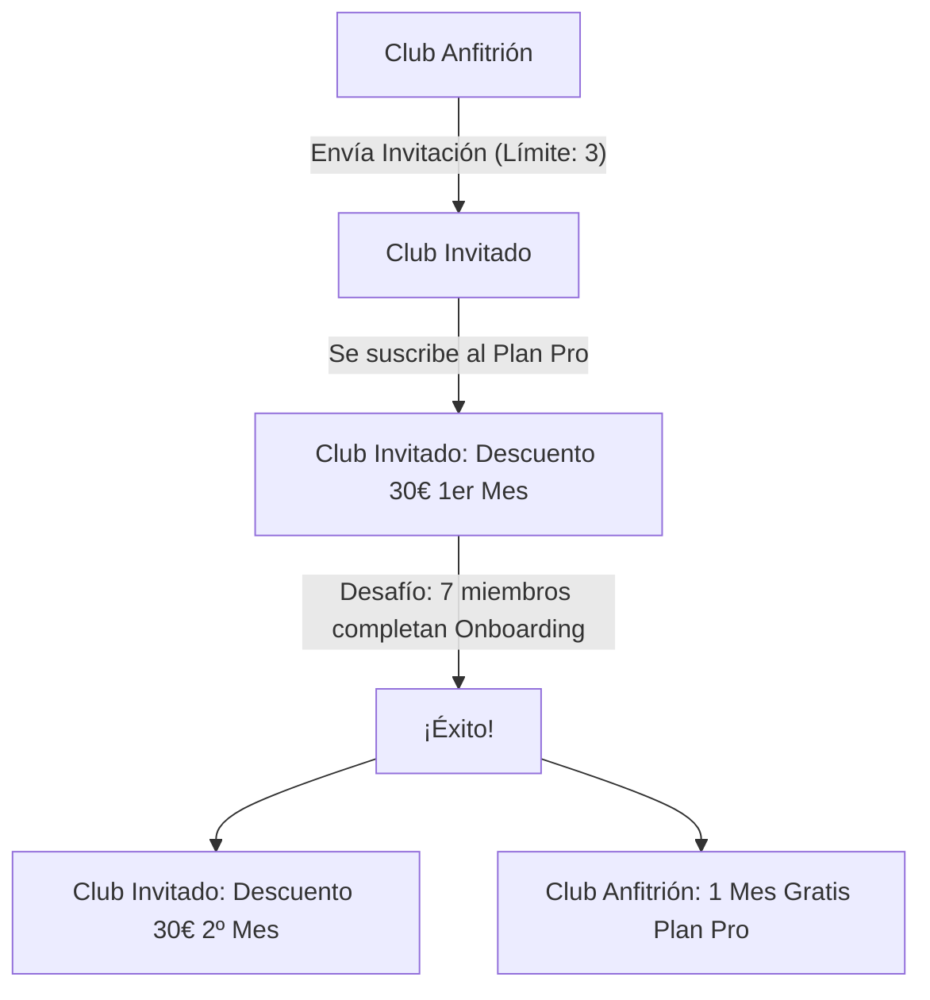

# Estrategia de Marketing: Programa de Referidos e Invitaciones

Este documento detalla la estrategia de adquisición de clientes y marketing de referidos para **ClubAgility**. La estrategia está diseñada para fomentar la recomendación orgánica entre clubes de agility, reduciendo el coste de adquisición de clientes (CAC) y acelerando el onboarding de nuevos usuarios para combatir el efecto "Ciudad Fantasma".

---

## 🎯 Resumen de la Estrategia

El programa se basa en un sistema de **invitaciones limitadas** que premia la recomendación exitosa y la activación real (adopción) del club invitado.

---

## 👥 Roles y Mecánicas

### 1. El Club Anfitrión (Referente)
*   **Cupo de Invitaciones:** Cada club registrado en la plataforma dispone de **3 invitaciones únicas** para invitar a otros clubes.
*   **Recompensa:** Si un club invitado completa el **Desafío de Activación**, el Club Anfitrión recibirá **1 mes gratis de su suscripción al Plan Pro** (equivalente a un abono de 49€ en su saldo de Stripe).

### 2. El Club Invitado (Referido)
*   **Descuento de Entrada:** Al registrarse a través de la invitación, el club invitado obtiene un **descuento de 30€ en el primer mes** de su suscripción al **Plan Pro** (ver [[planes-suscripcion-saas]]).
*   **Desafío de Activación (Tutoriales):** Para incentivar el uso real de la plataforma y evitar el abandono prematuro, el club invitado tiene un objetivo: **que al menos 7 de sus miembros completen el tutorial de onboarding** (los pasos detallados en [[estrategias-onboarding-ux]]).
*   **Recompensa por Activación:** Si logran completar este desafío, el club invitado recibe un **descuento adicional de 30€ en su segundo mes** de suscripción.

---

## 🛠️ Reglas de Negocio y Restricciones

> [!IMPORTANT] Restricciones de Uso
> 1. **Límite de Invitaciones:** Cada club tiene un límite estricto de **3 invitaciones**. Una vez usadas y reclamadas, no se podrán generar más invitaciones para ese club.
> 2. **Aplicación del Descuento:** El descuento se aplica exclusivamente al **Plan Pro** (el plan recomendado para la digitalización completa).
> 3. **Lógica de Facturación (Stripe):** 
>    - El descuento del primer mes se aplica de forma automática al configurar el método de pago e iniciar la suscripción mediante un cupón de Stripe de pago único.
>    - El descuento del segundo mes y el mes gratis para el club anfitrión se gestionan mediante eventos webhook de Stripe una vez verificado que se ha cumplido el desafío de activación (7 miembros con el tutorial de onboarding completado).

> [!NOTE] Sinergia con Onboarding
> Esta estrategia está diseñada en conjunto con el **Widget Flotante de Onboarding** detallado en [[estrategias-onboarding-ux]]. El contador de miembros que completan el tutorial sirve como métrica directa para la validación del desafío en el backend, transformando una estrategia de marketing en un motor de retención y adopción de la app.

---

## 📈 Flujo de Conversión de Stripe

1. **Invitación Aceptada:** El club invitado introduce el código de referido en el flujo de registro.
2. **Alta en Stripe:** Se aplica un cupón de `-30€` sobre el primer ciclo de facturación del Plan Pro.
3. **Monitoreo de Onboarding:** El sistema monitoriza en segundo plano cuántos usuarios con rol de Socio/Staff en el nuevo tenant completan su tutorial de onboarding.
4. **Hito Alcanzado (7 Tutoriales):**
   - Se emite una llamada a la API de Stripe para aplicar un cupón de `-30€` en la próxima factura del Club Invitado.
   - Se aplica un cupón del `100% de descuento` (1 mes gratis) en la siguiente factura del Club Anfitrión.
