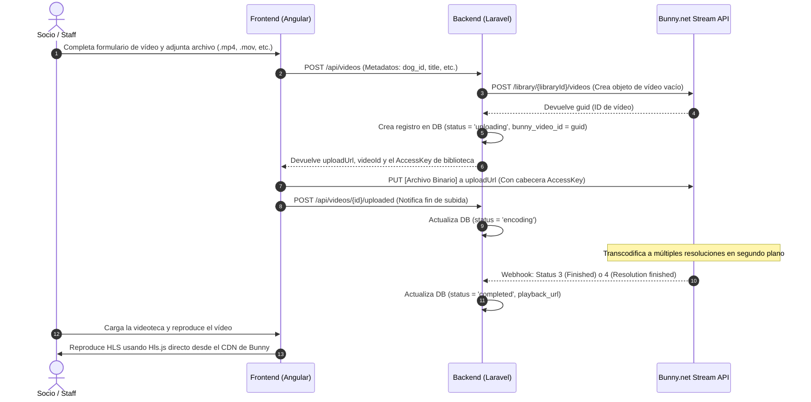

# 📹 Gestión de Vídeos y Pipelines de Streaming en ClubAgility

Este documento describe la arquitectura, la configuración de drivers y los flujos técnicos para el almacenamiento y reproducción de vídeos en la plataforma ClubAgility. 

Para adaptarse a diferentes presupuestos, arquitecturas de red y límites de infraestructura, ClubAgility soporta tres líneas de desarrollo (drivers) configurables desde el archivo de entorno `.env` mediante la variable `VIDEO_UPLOAD_DRIVER`.

---

## 🗺️ 1. Resumen de Líneas de Desarrollo

| Driver | Estado del Ciclo de Vida | Almacenamiento Destino | Reproductor Utilizado | Observaciones |
| :--- | :--- | :--- | :--- | :--- |
| **`bunny`** | **Activo (Opción Principal)** | Bunny.net Stream | HLS Nativo / Hls.js (`playlist.m3u8`) | Excelente coste, transcodificación integrada y CDN global ultrarrápida. |
| **`legacy`** | **Estable (Forma Antigua)** | Servidor Local + YouTube | Reproductor HTML5 local / Iframe YouTube | Probado y totalmente funcional. Sube al servidor local y un cron lo traslada a YouTube tras 3 días. |
| **`bitmovin`** | **Prototipo (A medias / Auxiliar)** | Mega S4 Bucket | HLS Nativo / Hls.js con Stream Proxy | API potente para transcodificación premium pero con mayor complejidad y costes de procesamiento. |

---

## 🚀 2. Bunny.net Stream (Opción Principal)

La integración con **Bunny.net Stream** es el pipeline de vídeo recomendado por su simplicidad, rendimiento y optimización de costes. Realiza un **offloading** completo del procesamiento de vídeo y el ancho de banda del servidor.

### Flujo de Trabajo (Secuencia Bunny)



### Detalle Técnico Bunny:

1. **Creación del Vídeo en el Servidor (Bunny API):**
   * Endpoint: `POST https://video.bunnycdn.com/library/{libraryId}/videos`
   * Cabecera: `AccessKey: {apiAccessKey}`
   * Cuerpo: `{"title": "Nombre del Vídeo"}`

2. **Subida Directa desde el Navegador:**
   * Endpoint de subida: `PUT https://video.bunnycdn.com/library/{libraryId}/videos/{bunnyVideoGuid}`
   * El frontend realiza una llamada PUT de flujo binario directo (`application/octet-stream`), enviando en las cabeceras el `AccessKey` temporal de la biblioteca. Esto evita que los archivos pasen por el backend de Laravel, ahorrando memoria y ancho de banda.

3. **Reproducción HLS Directa:**
   Al finalizar, Bunny genera una lista de reproducción accesible directamente desde su red de entrega de contenido (CDN):
   `https://iframe.mediadelivery.net/play/{libraryId}/{bunnyVideoGuid}/playlist.m3u8`
   Este manifiesto se carga directamente en el reproductor del club (`SmartVideoPlayerComponent`) usando la biblioteca `hls.js`, manteniendo la misma interfaz web y controles unificados sin usar iframes de terceros.

---

## 📜 3. Subida Local + YouTube (Driver Legacy)

El driver `legacy` ha sido la base de la plataforma y está **comprobado que funciona al 100%**. 

### Flujo Legacy:
1. **Subida Directa:** El usuario sube el archivo de vídeo a través de un formulario web normal. Laravel almacena el archivo directamente en su almacenamiento local público (`storage/app/public/clubs/{slug}/videos/`).
2. **Visualización Inmediata:** El vídeo se muestra de inmediato en la videoteca de los miembros reproduciéndose como un archivo `.mp4` estático local.
3. **Sincronización Automática con YouTube:**
   - Un comando de consola diario de Artisan (`php artisan videos:upload-to-youtube`) busca vídeos locales con más de 3 días de antigüedad.
   - Sube el vídeo al canal de YouTube configurado del club, obtiene el `youtube_id` y actualiza el estado a `on_youtube`.
   - Elimina el archivo `.mp4` del disco local de nuestro servidor para liberar espacio de forma automática.
   - A partir de este momento, el vídeo se reproduce en la app embebiendo el iframe de YouTube.

*Consulte la guía detallada del sistema legacy en **[[antigua-gestion-videos]]**.*

---

## 🚧 4. Bitmovin + Mega S4 (Opción Auxiliar / Prototipo a Medias)

Esta línea fue diseñada para construir un pipeline HLS personalizado de calidad profesional, utilizando el transcodificador premium de **Bitmovin** y el almacenamiento compatible con S3 de **Mega S4** como destino público.

> [!WARNING]
> **Estado actual: Prototipo a medias.**
> Se ha completado la integración del flujo de carga por PUT, el webhook de recepción y el proxy de streaming en backend. Sin embargo, está catalogado como auxiliar debido a limitaciones técnicas del almacenamiento destino (Mega S4 no soporta cabeceras S3 de asignación de ACLs `x-amz-acl`, lo que generaba errores de salida `30002 OUTPUT_ERROR` en Bitmovin) y a un coste de infraestructura más elevado.

### Detalles de la Integración Bitmovin:
* **Upload:** PUT directo del cliente a la URL de Bitmovin (`direct-file-upload`).
* **Output:** Configurado con `generic-s3` apuntando al host `s4.mega.io`.
* **CORS Stream Proxy:** Debido a las restricciones de CORS en el bucket de Mega, el backend expone una ruta intermedia `/api/videos/{id}/stream/manifest.m3u8` que hace de proxy de red para descargar los trozos `.ts` de Mega S4 y servirlos al frontend inyectando cabeceras CORS dinámicas.

---

## ⚙️ 5. Variables de Entorno del Sistema

Para alternar entre los distintos sistemas, configura la variable `VIDEO_UPLOAD_DRIVER` en tu archivo `.env` del backend junto a las credenciales correspondientes:

```env
# Driver Activo: 'bunny', 'legacy', o 'bitmovin'
VIDEO_UPLOAD_DRIVER=bunny

# 1. Configuración para Bunny.net Stream (Driver: bunny)
BUNNY_LIBRARY_ID=tu_library_id
BUNNY_API_KEY=tu_stream_api_key

# 2. Configuración para Bitmovin & Mega S4 (Driver: bitmovin)
BITMOVIN_API_KEY=tu_bitmovin_api_key
MEGA_S4_BUCKET=clubagility
MEGA_S4_ENDPOINT=s4.mega.io
MEGA_S4_KEY=tu_access_key
MEGA_S4_SECRET=tu_secret_key
MEGA_S4_REGION=eu-central-1

# 3. Configuración para YouTube (Driver: legacy)
YOUTUBE_CLIENT_ID=tu_client_id
YOUTUBE_CLIENT_SECRET=tu_client_secret
YOUTUBE_REFRESH_TOKEN=tu_refresh_token
```

---

## 🔔 6. Webhooks de Sincronización (Expose / Producción)

Para que los drivers asíncronos (`bunny` o `bitmovin`) funcionen, los respectivos paneles externos deben notificar a tu aplicación cuando la codificación finaliza.

### URLs de Webhooks
* **Bunny.net:** `https://tu-dominio.com/api/webhooks/bunny` (O su equivalente de Expose en local).
* **Bitmovin:** `https://tu-dominio.com/api/webhooks/bitmovin`.

### Códigos de Transcodificación Bunny
El endpoint del webhook de Bunny escucha el objeto `Status` retornado por Bunny Stream:
* **`Status: 3` (Finished) / `Status: 4` (Resolution finished):** Indica procesado correcto. El vídeo se marca como `completed` en base de datos.
* **`Status: 5` (Failed):** Indica fallo. El vídeo se marca como `failed`.
