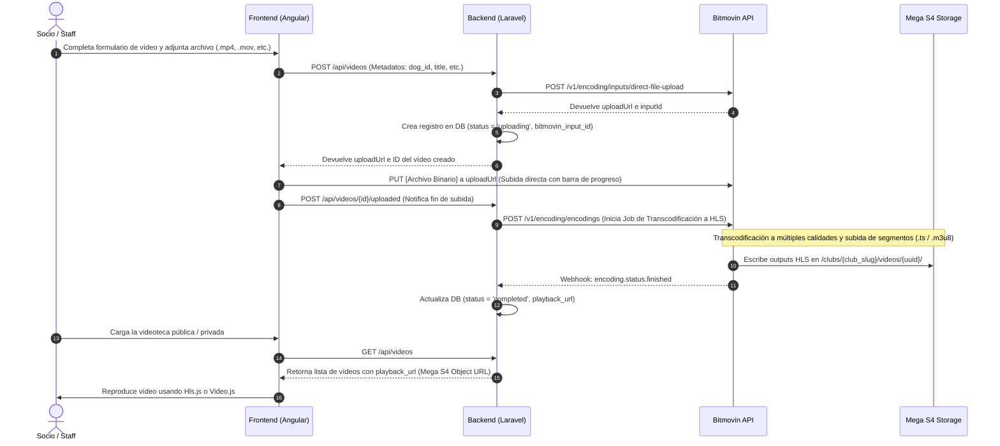

# 📹 Nueva Gestión de Vídeos (Bitmovin + Mega S4)

Esta documentación describe la arquitectura, el flujo de datos y la implementación técnica para la gestión de vídeos en la plataforma ClubAgility. El nuevo sistema sustituye la antigua carga en servidor y sincronización diaria con YouTube por un pipeline de transcodificación asíncrona de alto rendimiento y reproducción mediante streaming adaptativo (HLS).

> [!NOTE]
> Para consultar la documentación del sistema anterior basado en subidas locales y sincronización nocturna con YouTube, consulta la **[[antigua-gestion-videos]]**.

---

## 🏗️ 1. Nueva Arquitectura y Flujo de Carga

El nuevo flujo de carga minimiza el uso de recursos y ancho de banda en el servidor de la plataforma realizando un **offloading** de la subida del archivo de vídeo directamente desde el cliente hacia la API de Bitmovin.

### Diagrama de Secuencia del Sistema



### Detalle del Flujo de Carga

1. **Creación del Input en Bitmovin:**
   El backend realiza una llamada a la API de Bitmovin para solicitar un espacio temporal de subida:
   * **Endpoint:** `POST https://api.bitmovin.com/v1/encoding/inputs/direct-file-upload`
   * **Payload de Bitmovin:**
     ```json
     {
       "name": "Upload de vídeo ClubAgility",
       "description": "Subida temporal para transcodificación"
     }
     ```
   * **Respuesta:** Devuelve un objeto que contiene el `id` (utilizado como `bitmovin_input_id`) y una `uploadUrl`.

2. **Subida Directa desde el Cliente:**
   El cliente Angular realiza un HTTP `PUT` directamente a la `uploadUrl` obtenida.
   * **Cabeceras obligatorias:** `Content-Type: video/mp4` (o el tipo MIME correspondiente).
   * **Ventaja:** El servidor de Laravel no procesa los bytes del archivo original, evitando sobrecargas en memoria y timeouts de HTTP por subidas de hasta 500MB.

3. **Inicio de Codificación (VOD Encoding):**
   Una vez el cliente confirma la subida, el backend solicita el inicio del proceso de codificación en Bitmovin:
   * Se define el archivo subido en el input directo como origen.
   * Se define el almacenamiento **Mega S4** como destino (Output).
   * Se inicia el job de transcodificación que creará el manifiesto HLS (`manifest.m3u8`) y los archivos de segmento (`.ts`).

---

## ⚡ 2. Reproducción y Transcodificación

Para ofrecer una experiencia fluida y sin interrupciones en conexiones móviles a pie de pista, el vídeo original se procesa a través del pipeline de Bitmovin utilizando la tecnología **HLS (HTTP Live Streaming)**.

### Configuración del Pipeline de Transcodificación

Bitmovin procesa el vídeo de entrada y genera las siguientes variantes de calidad (Ladder de bitrate adaptativo):
* **1080p (FHD):** ~4500 kbps (Para pantallas grandes y conexiones Wi-Fi rápidas).
* **720p (HD):** ~2500 kbps (Calidad estándar recomendada).
* **480p (SD):** ~800 kbps (Para reproducción móvil fluida con baja cobertura).

Los resultados se escriben en el bucket de Mega S4 con la siguiente estructura de archivos:
```bash
/clubs/{club_slug}/videos/{uuid}/
  ├── manifest.m3u8             # Manifiesto maestro
  ├── video_1080p.m3u8          # Manifiesto variante 1080p
  ├── video_720p.m3u8           # Manifiesto variante 720p
  ├── video_480p.m3u8           # Manifiesto variante 480p
  ├── video_1080p_0001.ts       # Segmentos de vídeo en Full HD
  ├── video_720p_0001.ts        # Segmentos de vídeo en HD
  └── video_480p_0001.ts        # Segmentos de vídeo en SD
```

### Reproducción en Frontend (Angular)

El componente del frontend `SmartVideoPlayerComponent` detectará la extensión `.m3u8` en la URL de reproducción y utilizará la librería **`hls.js`** o un reproductor compatible (como **`Video.js`**) para renderizar el streaming adaptativo:
* El reproductor cambiará dinámicamente entre las calidades de 480p, 720p y 1080p dependiendo del ancho de banda disponible del usuario en tiempo real.
* Se mantendrá el soporte nativo `<video>` HTML5 para Safari, que soporta HLS sin librerías externas.

---

## 🔒 3. Seguridad, Aislamiento y Privacidad

Al utilizar streaming adaptativo HLS, **las Presigned URLs temporales tradicionales de S3 no son viables** de manera directa, ya que solo autorizan el archivo de manifiesto principal y bloquean las peticiones relativas a los segmentos `.ts`.

Para solventar esta limitación con seguridad, se implementa una arquitectura híbrida de **Object URLs con Ofuscación y Aislamiento**.

### Estrategia de Acceso: Object URLs Públicas + Ofuscación

1. **Habilitación de Object URLs en Mega S4:**
   Se activa la característica de **Object URLs** en el bucket de Mega S4 para la ruta de los vídeos transcodificados. Esto permite que cualquier recurso dentro de esa ruta sea accesible mediante una URL HTTP directa sin firmas criptográficas temporales.

2. **Seguridad mediante Ofuscación (UUIDv4):**
   Para garantizar la privacidad y que ningún usuario pueda listar o adivinar vídeos ajenos, las rutas de almacenamiento de los vídeos transcodificados se estructuran utilizando identificadores aleatorios UUIDv4:
   `https://s4.mega.io/v1/agility-videos/clubs/{club_slug}/videos/9b1deb4d-3b7d-4bad-9bdd-2b0d7b3dcb6d/manifest.m3u8`
   * Dado el espacio de nombres de UUIDv4, es criptográficamente imposible adivinar la ruta de un vídeo sin que el backend provea explícitamente su URL. Funciona de manera idéntica al flujo de vídeos "no listados" u "ocultos" de YouTube.

3. **Restricción de Origen (Referer Header en S4 Policy):**
   Como capa opcional de protección contra el "hotlinking" (uso de los enlaces en otras webs), se puede añadir una política al bucket de Mega S4 para que solo responda peticiones si la cabecera `Referer` coincide con los subdominios de la aplicación:
   ```json
   {
     "Version": "2012-10-17",
     "Statement": [
       {
         "Sid": "AllowRefererRestrictions",
         "Effect": "Allow",
         "Principal": "*",
         "Action": "s3:GetObject",
         "Resource": "arn:aws:s3:::agility-videos/*",
         "Condition": {
           "StringLike": {
             "aws:Referer": [
               "https://*.clubagility.com/*",
               "http://localhost:4200/*"
             ]
           }
         }
       }
     ]
   }
   ```

4. **Aislamiento Multi-Tenant (A nivel de Base de Datos y Backend):**
   * El backend de Laravel filtra estrictamente qué registros de la tabla `videos` puede ver cada usuario mediante el scope global de Tenant (`HasClub`).
   * Aunque una Object URL sea teóricamente accesible de forma directa si se conoce, un usuario malintencionado no tiene forma de obtener los enlaces de los vídeos de otros clubes, ya que el API solo expondrá las URLs de su correspondiente tenant.

---

## 💾 4. Modelo de Datos y Estados en el Backend

La tabla de base de datos `videos` gestionará el estado de las tareas en segundo plano mediante las siguientes columnas:

| Campo | Tipo | Descripción |
| :--- | :--- | :--- |
| `bitmovin_input_id` | `VARCHAR` | Identificador único del input temporal creado en Bitmovin. |
| `bitmovin_encoding_id` | `VARCHAR` | Identificador único de la tarea de transcodificación asignada. |
| `status` | `VARCHAR` | Estado del ciclo de vida: `uploading`, `uploaded`, `encoding`, `completed`, `failed`. |
| `s3_path` | `VARCHAR` | Ruta física en el bucket (e.g. `clubs/{club_slug}/videos/{uuid}/`). |
| `playback_url` | `TEXT` | URL pública directa del manifiesto HLS (`manifest.m3u8`) generada por Mega S4. |
| `error_message` | `TEXT` | Detalles técnicos en caso de que la codificación falle. |

### Ciclo de Estados de un Vídeo

* **`uploading`:** El backend ha registrado el vídeo y generado la URL de carga para el frontend. El usuario está subiendo los bytes del vídeo.
* **`uploaded`:** El frontend notifica que la subida directa a Bitmovin ha finalizado con éxito. El vídeo está listo para transcodificar.
* **`encoding`:** El backend ha lanzado el Job de codificación en Bitmovin. Los servidores de Bitmovin están procesando el vídeo.
* **`completed`:** Bitmovin ha finalizado con éxito la transcodificación y guardado los segmentos en Mega S4. La `playback_url` está disponible para su reproducción.
* **`failed`:** Ocurrió un error durante la codificación o la subida. Se registra el motivo en `error_message` para su consulta por el administrador.
