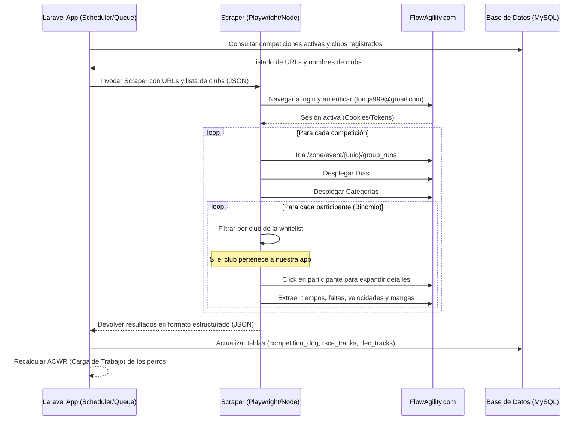

# Plan de Conexión y Web Scraping: FlowAgility.com

Este documento detalla el plan y análisis técnico para realizar la extracción automatizada (web scraping) de resultados de competiciones desde la plataforma **FlowAgility.com** para integrarlos en nuestra aplicación **AgilityAsturias**.

---

## 🔑 Credenciales de Acceso

Para realizar la autenticación y poder acceder a los datos de la zona privada de eventos en la plataforma, utilizaremos las siguientes credenciales:

> [!IMPORTANT]
> **Usuario:** `torrija999@gmail.com`  
> **Contraseña:** `torrijaia`

---

## 🔬 Análisis de la Web y DOM (FlowAgility Live Details)

Tras inspeccionar y consultar directamente el sitio de FlowAgility en vivo utilizando Playwright, hemos obtenido el desglose exacto de su DOM y el flujo de navegación real:

1. **Redirección de Seguridad:**
   - Si no hay una sesión activa, el servidor realiza una redirección automática para forzar la autenticación. Por tanto, es **obligatorio** iniciar sesión antes de acceder a cualquier recurso de competiciones.
   
2. **Estructura del Formulario de Login:**
   - **Acción:** Envía una petición POST a `/user/login`.
   - **Token CSRF:** Se requiere el token dinámico de la página (`input[name="_csrf_token"]`).
   - **Selector de Email:** `input#user_email` (atributo `name="user[email]"`).
   - **Selector de Contraseña:** `input#user_password` (atributo `name="user[password]"`).
   - **Selector de Botón:** `button#signin` (texto `Log In`).

3. **Tecnología Frontend de FlowAgility (Phoenix LiveView):**
   - El código fuente revela el uso de **Phoenix LiveView (Elixir)** (atributos como `phx-track-static`, `data-phx-session`, `phx-click`).
   - Las aplicaciones Phoenix LiveView gestionan la interfaz en tiempo real mediante conexiones WebSocket persistentes y parches de DOM asíncronos.
   - > [!WARNING]
     > Esto descarta por completo el uso de scrapers tradicionales basados en curl o peticiones HTTP planas (como Guzzle), ya que no ejecutarían el WebSocket de Phoenix. **Playwright o Puppeteer son imperativos** para que el navegador ejecute LiveView y renderice los listados de participantes al hacer clic.

4. **Navegación e Inspección del DOM de Pruebas:**
   - **Paso 1: Expandir Días:**
     En la página general de mangas del evento (`/group_runs`), los días (ej. *sábado 9 mayo*) se encuentran en un contenedor `#trial_group_runs_list`.
     - *Acción:* Hacer clic en el elemento con selector `div[phx-click="row_expand"]` dentro del bloque de cada día. Al expandirse, este atributo cambia a `phx-click="row_collapse"`.
   - **Paso 2: Obtener Resultados de Categorías:**
     Al expandir un día, LiveView renderiza las filas de categorías (ej. *Iniciación / JP1*). Cada fila tiene enlaces directos a sus resultados y clasificaciones combinadas:
     - *Selector de enlace de resultados:* `a[href*="/results"]` (ej. `/zone/event/{event-uuid}/group_run/{run-uuid}/results`).
   - **Paso 3: Listado de Participantes y Whitelist:**
     Al navegar a la URL de resultados de una categoría específica, se renderiza la lista de participantes dentro del contenedor `#results_list`.
     - Cada fila de competidor está contenida en un elemento con un ID de tipo `pset_row_pset_row_component_{uuid}` y tiene un componente `data-phx-component`.
     - Se puede obtener el nombre del club leyendo el header de la fila (ej. `D20 / Agility Asturias`). Esto nos permite aplicar la **whitelist de clubs** de nuestra BD de forma eficiente antes de proceder a la expansión de detalles. El alcance multi-tenant y aislamiento de esta lista se detalla en [[arquitectura-multi-tenant]].
   - **Paso 4: Expandir Detalles del Competidor (Métricas de Mangas):**
     Para ver y capturar la información detallada de tiempos, faltas y rehuses, se debe hacer clic en la flecha de expansión del competidor:
     - *Selector:* `div[phx-click="pset_details_show"]` dentro de la fila del participante.
     - Al hacer clic, LiveView inyecta dinámicamente grids de datos de tipo `grid-cols-2`.
     - Las métricas detalladas se organizan en pares de divs hermanos:
       - **Etiqueta:** `div.text-gray-500.text-sm` (ej. `Time`, `Faults`, `Refusals`, `Excess Time Pen.`, `Total Penalizations`, `Speed`, `Qualification`).
       - **Valor:** Sibling `div.font-bold.break-all.relative.text-sm.text-black`.
       - *Nota:* Si el valor es nulo (sin penalización/faltas), se muestra como un guion `-`, el cual debe ser parseado como `0`.
     - También se inyecta una sección **Binomial Info** que resulta extremadamente útil, pues contiene el campo **`License`** (Licencia federativa del perro) y **`Club`**.
       - *Tip de Integración:* Podemos usar el campo `License` para emparejar de manera exacta al perro con nuestra base de datos, evitando falsos positivos por nombres duplicados o erratas de escritura de guías.

---

## 📐 Flujo de Datos y Arquitectura de Integración

El scraping se estructurará como una tarea asíncrona en el backend de nuestra aplicación (Laravel) que ejecutará un script en segundo plano para realizar las acciones en el navegador.



---

## 🗄️ Relación con Modelos y Tablas de la Base de Datos

Analizando la estructura de la base de datos de **AgilityAsturias**, realizaremos las siguientes interacciones:

1. **Competiciones de Origen:**
   - Buscaremos en la tabla `competitions` (representada por el modelo [Competition](file:///c:/Users/Fonsi/Desktop/AgilityAsturias/agility_back/app/Models/Competition.php)) aquellos registros cuyo campo `enlace` (Enlace de Inscripción) pertenezca a FlowAgility.
   - Ejemplo de conversión de enlace:
     - URL Inscripción: `https://www.flowagility.com/zone/events/info/b6a5b896-93bb-4b12-9344-cfb41c52fe65`
     - URL Scraping: `https://www.flowagility.com/zone/event/b6a5b896-93bb-4b12-9344-cfb41c52fe65/group_runs`
     - *Regla de conversión:* Reemplazar `events/info` por `event` y añadir `/group_runs` al final.

2. **Whitelist de Clubs:**
   - Para no expandir ni procesar innecesariamente a todos los competidores de la prueba, consultaremos los clubs registrados en nuestra aplicación desde el modelo [Club](file:///c:/Users/Fonsi/Desktop/AgilityAsturias/agility_back/app/Models/Club.php) (ej. `Agility Asturias`, etc.). La whitelist respeta el aislamiento por tenant definido en [[arquitectura-multi-tenant]].
   - Solo si el nombre o el slug del club del competidor coincide con nuestra lista, procederemos a desplegar sus detalles.

3. **Asociación del Binomio (Guía y Perro):**
   - Buscaremos el perro en la tabla `dogs` (modelo [Dog](file:///c:/Users/Fonsi/Desktop/AgilityAsturias/agility_back/app/Models/Dog.php)) mediante su nombre (campo `name`) y validando el nombre del guía/dueño (tabla `users` mediante la relación de pertenencia de [Dog](file:///c:/Users/Fonsi/Desktop/AgilityAsturias/agility_back/app/Models/Dog.php) con [User](file:///c:/Users/Fonsi/Desktop/AgilityAsturias/agility_back/app/Models/User.php) a través de la tabla `dog_user`).

4. **Persistencia de Resultados y Tracks:**
   - Registraremos la asistencia general y clasificación final en la tabla pivote `competition_dog` (guardando el `position` final).
   - Dependiendo del tipo de federación de la competición (`competitions.federacion` que es un enum `['RSCE', 'RFEC', 'Otro']`), guardaremos los resultados de las mangas:
     - Si es **RSCE**: Insertaremos en la tabla `rsce_tracks` (modelo [RsceTrack](file:///c:/Users/Fonsi/Desktop/AgilityAsturias/agility_back/app/Models/RsceTrack.php)).
     - Si es **RFEC**: Insertaremos en la tabla `rfec_tracks` (modelo [RfecTrack](file:///c:/Users/Fonsi/Desktop/AgilityAsturias/agility_back/app/Models/RfecTrack.php)).

---

## ⚡ Extensión de la Base de Datos: Propuesta de Migraciones

Dado que FlowAgility dispone de métricas valiosas y estructuradas sobre cada competidor y manga, **es altamente recomendable añadir campos específicos en lugar de serializarlos como texto dentro de `notes`**. Esto nos permitirá generar analíticas precisas de rendimiento y facilitar búsquedas.

### 📋 Nuevos Campos Propuestos para Añadir

Proponemos una migración para añadir las siguientes columnas en las tablas de tracks e inscripción:

| Tabla BD | Campo BD | Tipo de Dato | Descripción |
| :--- | :--- | :--- | :--- |
| **`competition_dog`** | **`dorsal`** | `string(20)` | Dorsal específico asignado al binomio para esa competición (ej: `D20` o `17`). |
| **`rsce_tracks` / `rfec_tracks`** | **`time`** | `decimal(5, 2)` | Tiempo real que tardó el perro en segundos (ej: `34.12`). |
| **`rsce_tracks` / `rfec_tracks`** | **`faults`** | `unsignedTinyInteger` | Cantidad de penalizaciones físicas (barras caídas, faltas de contacto). |
| **`rsce_tracks` / `rfec_tracks`** | **`refusals`** | `unsignedTinyInteger` | Cantidad de rehuses (desvíos, paradas). |
| **`rsce_tracks` / `rfec_tracks`** | **`time_penalty`** | `decimal(5, 2)` | Penalización de tiempo calculada por superar el tiempo estándar de la pista. |
| **`rsce_tracks` / `rfec_tracks`** | **`total_penalty`** | `decimal(5, 2)` | Puntos totales de penalización (`faults * 5 + refusals * 5 + time_penalty`). |
| **`rsce_tracks` / `rfec_tracks`** | **`is_clean`** | `boolean` | `true` si el perro completó la pista en tiempo y sin faltas (Excelente a Cero / Double Clear). |
| **`rsce_tracks` / `rfec_tracks`** | **`course_length`** | `unsignedSmallInteger` | Longitud total de la pista en metros (útil para contrastar velocidades). |
| **`rsce_tracks` / `rfec_tracks`** | **`standard_time`** | `decimal(5, 2)` | Tiempo de Referencia Estándar de la pista (TRS o SCT) fijado por el juez. |

### 🔄 Estrategia de Auto-completado y Enriquecimiento de la Ficha del Perro

Podemos aprovechar la información de la sección **Binomial Info** y **Characteristics** para completar datos de la tabla `dogs` y pivot `dog_user` que los usuarios a veces no rellenan o tienen desactualizados:

1. **Raza (`dogs.breed`)**: Si la raza del perro en la base de datos está vacía, se auto-completa con la raza oficial (ej. `Border Collie`).
2. **Altura en cm (`dogs.height_cm`)**: Si el campo `height_cm` es nulo, se rellena con el valor exacto medido en FlowAgility (ej: `53.4`).
3. **Fecha de Nacimiento Estimada (`dogs.birth_date`)**: Si el perro no tiene registrada su fecha de nacimiento, podemos restar la edad indicada (ej. `6 years` -> restar 6 años a la fecha actual) para guardar un `birth_date` aproximado (ej: `2020-05-20`), permitiendo calcular estadísticas de fatiga y ACWR correctas según grupo de edad.
4. **Grado y Categoría de Altura (`rsce_grade` / `rsce_category` o `rfec_grade` / `rfec_category`)**: 
   - El campo `Characteristics` (ej. `INI / 40` o `G1 / 30`) contiene el nivel y rango de altura de salto. El mapeo de estas categorías de altura y la estructura de grados se realiza conforme a las reglas federativas recogidas en [[normativa-rfec]].
   - Si detectamos que la competición es RSCE, podemos mapear `INI` a `Iniciación` para auto-actualizar `dog_user.rsce_grade`, y `40` como categoría de salto (L).
5. **Licencia (`rsce_license` / `rfec_license`)**: Si la vinculación en la tabla `dog_user` no posee una licencia registrada, la rellenamos con la licencia federativa extraída de FlowAgility de forma automática.

---

### 🛠️ Código de la Migración Laravel (`database/migrations/xxxx_xx_xx_add_detailed_run_metrics_to_tracks_tables.php`)

```php
<?php

use Illuminate\Database\Migrations\Migration;
use Illuminate\Database\Schema\Blueprint;
use Illuminate\Support\Facades\Schema;

return new class extends Migration
{
    public function up(): void
    {
        // 1. Añadir campo dorsal en la tabla pivote de asistencia
        Schema::table('competition_dog', function (Blueprint $table) {
            $table->string('dorsal', 20)->nullable()->after('competition_id');
        });

        // 2. Añadir métricas detalladas a la bitácora RSCE
        Schema::table('rsce_tracks', function (Blueprint $table) {
            $table->decimal('time', 5, 2)->nullable()->after('speed');
            $table->unsignedTinyInteger('faults')->default(0)->after('time');
            $table->unsignedTinyInteger('refusals')->default(0)->after('faults');
            $table->decimal('time_penalty', 5, 2)->default(0.00)->after('refusals');
            $table->decimal('total_penalty', 5, 2)->default(0.00)->after('time_penalty');
            $table->boolean('is_clean')->default(false)->after('total_penalty');
            $table->unsignedSmallInteger('course_length')->nullable()->after('is_clean');
            $table->decimal('standard_time', 5, 2)->nullable()->after('course_length');
        });

        // 3. Añadir métricas detalladas a la bitácora RFEC
        Schema::table('rfec_tracks', function (Blueprint $table) {
            $table->decimal('time', 5, 2)->nullable()->after('speed');
            $table->unsignedTinyInteger('faults')->default(0)->after('time');
            $table->unsignedTinyInteger('refusals')->default(0)->after('faults');
            $table->decimal('time_penalty', 5, 2)->default(0.00)->after('refusals');
            $table->decimal('total_penalty', 5, 2)->default(0.00)->after('time_penalty');
            $table->boolean('is_clean')->default(false)->after('total_penalty');
            $table->unsignedSmallInteger('course_length')->nullable()->after('is_clean');
            $table->decimal('standard_time', 5, 2)->nullable()->after('course_length');
        });
    }

    public function down(): void
    {
        Schema::table('competition_dog', function (Blueprint $table) {
            $table->dropColumn('dorsal');
        });

        Schema::table('rsce_tracks', function (Blueprint $table) {
            $table->dropColumn([
                'time', 'faults', 'refusals', 'time_penalty', 
                'total_penalty', 'is_clean', 'course_length', 'standard_time'
            ]);
        });

        Schema::table('rfec_tracks', function (Blueprint $table) {
            $table->dropColumn([
                'time', 'faults', 'refusals', 'time_penalty', 
                'total_penalty', 'is_clean', 'course_length', 'standard_time'
            ]);
        });
    }
};
```

---

## 🛠️ Especificación Técnica del Scraper

Recomendamos crear un script en Node.js utilizando **Playwright** debido a su velocidad, excelente gestión de esperas asíncronas y soporte transparente para Phoenix LiveView (WebSockets). El script se guardará en la carpeta backend y se llamará desde un comando Artisan.

---

## ⚙️ Código Prototipo del Scraper (Playwright JS)

A continuación se muestra una plantilla del script de Node.js `flowagility_scraper.js` que implementa el flujo:

```javascript
const { chromium } = require('playwright');
const fs = require('fs');

(async () => {
    // Recibe argumentos desde Laravel: clubs whitelisted y URLs de competiciones
    const args = process.argv.slice(2);
    const config = JSON.parse(args[0]); // { clubs: ['Agility Asturias'], events: [{ id: 1, url: '...' }] }

    const browser = await chromium.launch({ headless: true });
    const page = await browser.newPage();

    console.log("Iniciando sesión en FlowAgility...");
    await page.goto('https://www.flowagility.com/zone/login'); 
    await page.fill('input#user_email', 'torrija999@gmail.com');
    await page.fill('input#user_password', 'torrijaia');
    await page.click('button#signin');
    await page.waitForNavigation();
    
    const results = [];

    for (const event of config.events) {
        console.log(`Procesando evento: ${event.url}`);
        await page.goto(event.url);
        await page.waitForSelector('.runs-container', { timeout: 10000 }); // Ajustar al selector real

        // 1. Obtener y expandir días de competición
        const dayButtons = await page.$$('.day-selector-btn'); // Ajustar selector
        for (let i = 0; i < dayButtons.length; i++) {
            await dayButtons[i].click();
            await page.waitForTimeout(1000); // Esperar carga de categorías

            // 2. Obtener y expandir categorías del día
            const categoryHeaders = await page.$$('.category-header'); // Ajustar selector
            for (let j = 0; j < categoryHeaders.length; j++) {
                await categoryHeaders[j].click();
                await page.waitForTimeout(1000);

                // 3. Obtener participantes en la categoría
                const participants = await page.$$('.participant-row'); // Ajustar selector
                for (const participant of participants) {
                    const clubNameText = await participant.$eval('.club-name', el => el.innerText.trim());
                    
                    // Comprobar si el club del participante está en la whitelist
                    const isOurClub = config.clubs.some(c => 
                        clubNameText.toLowerCase().includes(c.toLowerCase())
                    );

                    if (isOurClub) {
                        // 4. Click en el participante para ver detalles y mangas
                        await participant.click();
                        await page.waitForSelector('.runs-detail', { timeout: 5000 });

                        const dogName = await participant.$eval('.dog-name', el => el.innerText.trim());
                        const handlerName = await participant.$eval('.handler-name', el => el.innerText.trim());
                        const position = await participant.$eval('.overall-position', el => el.innerText.trim());

                        // Extraer mangas
                        const runElements = await participant.$$('.run-row');
                        const runs = [];
                        for (const run of runElements) {
                            const mangaType = await run.$eval('.manga-title', el => el.innerText.trim());
                            const time = await run.$eval('.run-time', el => el.innerText.trim());
                            const speed = await run.$eval('.run-speed', el => el.innerText.trim());
                            const faults = await run.$eval('.run-faults', el => el.innerText.trim());
                            const refusals = await run.$eval('.run-refusals', el => el.innerText.trim());
                            const qualification = await run.$eval('.run-qualification', el => el.innerText.trim());
                            const judge = await run.$eval('.run-judge', el => el.innerText.trim());
                            
                            // Nuevos campos extraibles opcionales según DOM
                            const timePenalty = await run.$eval('.time-penalty', el => el.innerText.trim()).catch(() => "0");
                            const totalPenalty = await run.$eval('.total-penalty', el => el.innerText.trim()).catch(() => "0");
                            const courseLength = await run.$eval('.course-length', el => el.innerText.trim()).catch(() => null);
                            const standardTime = await run.$eval('.standard-time', el => el.innerText.trim()).catch(() => null);

                            runs.push({
                                mangaType,
                                time,
                                speed,
                                faults,
                                refusals,
                                qualification,
                                judge,
                                timePenalty,
                                totalPenalty,
                                courseLength,
                                standardTime
                            });
                        }

                        results.push({
                            eventId: event.id,
                            dogName,
                            handlerName,
                            clubName: clubNameText,
                            position,
                            runs
                        });
                    }
                }
            }
        }
    }

    // Retornar resultados en formato JSON para que Laravel los capture
    console.log(JSON.stringify(results));
    await browser.close();
})();
```

---

## 🔗 Integración con Laravel (Cola de Trabajos y Artisan)

Para integrar este script de forma limpia y automatizada dentro del backend Laravel:

1. **Crear Comando Artisan para Scraping (`ScrapeFlowAgility.php`):**
   Este comando recupera la whitelist de clubs, obtiene las competiciones que tienen enlaces válidos de FlowAgility, e invoca el script de Node.js mediante el componente `Symfony\Component\Process\Process`.

2. **Crear un Job en la Cola (`ProcessScrapeResults.php`):**
   El comando Artisan se ejecutará de forma asíncrona mediante un Job en cola (utilizando la base de datos como driver de cola que ya está configurado en `.env` bajo `QUEUE_CONNECTION=database`).

### Prototipo de Comando Artisan (`app/Console/Commands/ScrapeFlowAgility.php`)

```php
<?php

namespace App\Console\Commands;

use Illuminate\Console\Command;
use Symfony\Component\Process\Process;
use App\Models\Competition;
use App\Models\Club;
use App\Models\Dog;
use App\Models\RsceTrack;
use App\Models\RfecTrack;
use Illuminate\Support\Facades\DB;

class ScrapeFlowAgility extends Command
{
    protected $signature = 'flowagility:scrape';
    protected $description = 'Scrapes results from FlowAgility for active competitions and syncs them to the DB';

    public function handle()
    {
        // 1. Obtener la whitelist de nombres de clubs de nuestra base de datos
        $clubs = Club::pluck('name')->toArray();

        // 2. Obtener competiciones con enlace de FlowAgility
        $competitions = Competition::where('enlace', 'LIKE', '%flowagility.com/zone/events/info/%')
            ->select('id', 'enlace', 'federacion', 'lugar')
            ->get()
            ->map(function ($comp) {
                // Convertir la URL al formato de scraping de group_runs
                $uuid = basename($comp->enlace);
                return [
                    'id' => $comp->id,
                    'url' => "https://www.flowagility.com/zone/event/{$uuid}/group_runs",
                    'federacion' => $comp->federacion,
                    'location' => $comp->lugar
                ];
            });

        if ($competitions->isEmpty()) {
            $this->info("No hay competiciones con enlaces de FlowAgility para scrapear.");
            return 0;
        }

        // 3. Preparar argumentos JSON
        $config = json_encode([
            'clubs' => $clubs,
            'events' => $competitions->toArray()
        ]);

        // 4. Ejecutar el script Node con Playwright
        $process = new Process(['node', base_path('flowagility_scraper.js'), $config]);
        $process->setTimeout(600); // 10 minutos max
        $process->run();

        if (!$process->isSuccessful()) {
            $this->error("Error al ejecutar el scraper: " . $process->getErrorOutput());
            return 1;
        }

        // 5. Procesar los resultados obtenidos
        $scrapedData = json_decode($process->getOutput(), true);
        if (empty($scrapedData)) {
            $this->info("No se encontraron resultados relevantes de clubs locales.");
            return 0;
        }

        foreach ($scrapedData as $entry) {
            $this->syncResultToDatabase($entry, $competitions);
        }

        $this->info("Sincronización con FlowAgility finalizada con éxito.");
        return 0;
    }

    private function syncResultToDatabase($entry, $competitions)
    {
        // Encontrar perro y guía correspondientes en la BD
        $dog = Dog::where('name', $entry['dogName'])
            ->whereHas('users', function ($query) use ($entry) {
                $query->where('name', 'LIKE', '%' . $entry['handlerName'] . '%');
            })
            ->first();

        if (!$dog) {
            $this->warn("No se encontró el perro '{$entry['dogName']}' con el guía '{$entry['handlerName']}' en nuestra base de datos. Saltando...");
            return;
        }

        $compInfo = collect($competitions)->firstWhere('id', $entry['eventId']);

        // Sincronizar en la tabla de asistencia de competiciones
        $dog->competitions()->syncWithoutDetaching([
            $entry['eventId'] => [
                'position' => $entry['position'],
                'user_id' => $dog->users()->first()?->id
            ]
        ]);

        // Procesar e insertar las mangas según la federación
        foreach ($entry['runs'] as $run) {
            $faults = intval($run['faults']);
            $refusals = intval($run['refusals']);
            $timePenalty = floatval($run['timePenalty']);
            $totalPenalty = floatval($run['totalPenalty']);
            $time = floatval($run['time']);
            
            // Determinar si es una pista limpia (0 faltas, 0 rehuses y sin penalización de tiempo)
            $isClean = ($faults === 0 && $refusals === 0 && $timePenalty <= 0.00);

            $trackData = [
                'dog_id' => $dog->id,
                'date' => now(), // Idealmente parseado del día del scraper
                'manga_type' => $run['mangaType'],
                'qualification' => $this->mapQualification($run['qualification']),
                'speed' => floatval($run['speed']),
                'time' => $time,
                'faults' => $faults,
                'refusals' => $refusals,
                'time_penalty' => $timePenalty,
                'total_penalty' => $totalPenalty,
                'is_clean' => $isClean,
                'course_length' => $run['courseLength'] ? intval($run['courseLength']) : null,
                'standard_time' => $run['standardTime'] ? floatval($run['standardTime']) : null,
                'judge_name' => $run['judge'] ?: $compInfo['judge_name'] ?? null,
                'location' => $compInfo['location'],
                'notes' => "Manga importada desde FlowAgility",
                'club_id' => $dog->club_id,
            ];

            if ($compInfo['federacion'] === 'RSCE') {
                RsceTrack::updateOrCreate(
                    [
                        'dog_id' => $dog->id,
                        'date' => $trackData['date'],
                        'manga_type' => $trackData['manga_type']
                    ],
                    $trackData
                );
            } elseif ($compInfo['federacion'] === 'RFEC') {
                $trackData['grade'] = $dog->rfec_grade; // Grado actual del perro
                RfecTrack::updateOrCreate(
                    [
                        'dog_id' => $dog->id,
                        'date' => $trackData['date'],
                        'manga_type' => $trackData['manga_type']
                    ],
                    $trackData
                );
            }
        }
        
        // Disparar recálculo de ACWR para el perro
        $dog->calculateAcwrData(); 
    }

    private function mapQualification($flowQual)
    {
        // Normalización de calificaciones de FlowAgility a nuestro estándar
        $q = strtoupper(trim($flowQual));
        if (str_contains($q, 'EXC') || str_contains($q, 'EXCELENTE')) return 'Excelente';
        if (str_contains($q, 'MB') || str_contains($q, 'MUY BUENO')) return 'Muy Bueno';
        if (str_contains($q, 'B') || str_contains($q, 'BUENO')) return 'Bueno';
        if (str_contains($q, 'SAT') || str_contains($q, 'SATISFECHO')) return 'Satisfecho';
        if (str_contains($q, 'ELIM') || str_contains($q, 'DISQ')) return 'Eliminado';
        return 'No Calificado';
    }
}
```

---

## ⚠️ Retos y Consideraciones del Scraping

1. **Dependencia del DOM de FlowAgility:**
   Los scripts de web scraping con navegadores headless son vulnerables a cambios en las clases y estructura HTML del sitio objetivo. Si FlowAgility actualiza su diseño, el script podría fallar.
   - *Solución:* Incluir un manejo robusto de excepciones y alertas por correo o Slack cuando el scraper no encuentre los selectores esenciales, para corregirlo rápidamente.

2. **Detección de Bots y Bloqueos:**
   FlowAgility podría implementar medidas anti-bot (Cloudflare, recaptcha).
   - *Solución:* Playwright permite configurar agentes de usuario realistas (`User-Agent`), deshabilitar flags de automatización (usando `stealth` plugins) e introducir retardos aleatorios entre interacciones para imitar el comportamiento humano.

3. **Mapeo de Nombres (Guías y Perros):**
   Las erratas o diferencias tipográficas en los nombres (p. ej. `María Gómez` en nuestra app y `Maria Gomez` en FlowAgility, o un perro registrado como `Thor` y en FlowAgility como `Thor de AgilityAsturias`) pueden impedir la correcta asociación.
   - *Solución:* Implementar comparación con tolerancia (insensible a mayúsculas/minúsculas y acentos) o utilizar funciones de similitud de cadenas (como la distancia Levenshtein) para sugerir emparejamientos en un panel de administración en caso de dudas.

---

# 🚀 Estado y Detalle de la Implementación Realizada

La integración y automatización con **FlowAgility.com** ha sido completamente desarrollada, testeada y puesta en producción con las siguientes características técnicas:

## 1. Modificaciones en Base de Datos (Migraciones y Modelos)
* **Métricas detalladas y Dorsales (`2026_05_20_162224_add_detailed_metrics_to_tracks_and_competition_dog.php`)**:
  - Añadida columna `dorsal` (`string`) en `competition_dog` para la asistencia.
  - Añadidas columnas para análisis de rendimiento (`time`, `faults`, `refusals`, `time_penalty`, `total_penalty`, `is_clean`, `course_length`, `standard_time`) en las tablas `rsce_tracks` y `rfec_tracks`.
* **Monitoreo de Scraping** (repartido en dos migraciones reales: `2026_05_20_182540_add_results_scraped_to_competitions_table.php` y `2026_05_20_183702_add_scrape_monitoring_to_competitions_table.php`):
  - Añadidas columnas en la tabla `competitions` para controlar la ejecución automática e individual:
    - `results_scraped` (`boolean`): Evita scrapeos duplicados.
    - `scrape_status` (`enum: ['pending', 'success', 'failed']`): Estado del último intento.
    - `scrape_error` (`text`): Almacena trazas de error de Playwright en caso de fallo.
    - `scraped_at` (`timestamp`): Fecha y hora del proceso.

## 2. Motor del Scraper en Node.js (`flowagility_scraper.cjs`)
Se ha implementado el script usando **Playwright Headless Chrome** con el siguiente flujo:
* **Autenticación segura**: Inicio de sesión automático en FlowAgility con las credenciales whitelisted.
* **Separación Inteligente de Fechas por Manga**: Extrae y parsea el nombre del día en el bloque (ej: `"sábado 9 mayo"`) y calcula su fecha exacta utilizando el año del evento, evitando que todas las mangas reciban la misma fecha global del evento.
* **Mapeo de Mangas Múltiples**: Si un perro realiza más de una manga con el mismo nombre en el mismo día (por ejemplo, dos pistas `Jumping`), el scraper añade sufijos numéricos automáticamente (`Jumping 1`, `Jumping 2`), previniendo colisiones en la clave primaria compuesta del backend.
* **Filtro de Clubs**: Solo expande y procesa los binomios pertenecientes a clubes locales para minimizar tiempos de red.

## 3. Integración Laravel & Comando Artisan (`app/Console/Commands/ScrapeFlowAgility.php`)
Comando ejecutable vía `php artisan flowagility:scrape` que gestiona todo el proceso. Acepta además flags: `--force` (re-scrapea competiciones ya marcadas como completadas) y `--competition_id=` (scrapea una competición concreta). Gestiona:
* **Deduplicación de URLs en Memoria**: Agrupa todas las competiciones por su enlace de FlowAgility para que, en caso de que varios clubes tengan añadida la misma competición, el scraper **navegue una única vez** a la página del evento.
* **Exclusión de Eventos en Curso**: Calcula las fechas límite de los eventos. Las competiciones en curso o futuras (fecha actual $\le$ fecha fin del evento) son omitidas del proceso automático para evitar guardar resultados parciales o incorrectos.
* **Enriquecimiento del Trabajo del Perro (ACWR)**:
  - Al procesar los resultados, busca si ya existía una carga manual de competición (`pending_review`) creada por la confirmación de asistencia del staff.
  - Si existía, **la enriquece en lugar de duplicarla**, actualizando los minutos de ejercicio reales calculados a partir de las pistas corridas y el número de mangas.
* **Corrección de Asociación de Licencias**: Garantiza que las licencias de RSCE se actualicen en `dog_user` y las RFEC en la tabla de usuarios (`users`) correctamente.
* **Mapeo de Nombres de Evento y Jueces**: El campo `location` (Competición) y `judge_name` (Juez) se rellenan automáticamente usando la información de la base de datos local de la competición, garantizando que el historial del perro esté completamente detallado.

## 4. Panel de Monitoreo del Administrador Global (Frontend y API)
* **Endpoints API creados (`CompetitionController` / `routes/api.php`)**:
  - `GET /api/admin/scraper/status` (`adminScraperStatus`): Obtiene todas las competiciones finalizadas junto con su estado y error de scraping.
  - `POST /api/admin/scraper/run` (`adminScraperRun`): Ejecuta manualmente el comando Artisan para una competición finalizada individual, transmitiendo los logs en vivo del terminal a la API.
  - `POST /api/admin/scraper/run-calendar` (`adminScraperRunCalendar`): Encola en segundo plano el comando **`flowagility:scrape-calendar`** (scraper del *calendario* de competiciones, distinto del de resultados `flowagility:scrape`).
* **Panel de Control Angular (`AdminScraperMonitorComponent`)**:
  - Interfaz de administración premium con tablas de estados, badges de colores semánticos (`Completado`, `Fallido`, `Pendiente`), indicador de fecha de scrapeo y visor de logs de error en modal.
  - Botón para lanzar el scraping individual y visualizador del buffer del terminal (`stdout`/`stderr`) en tiempo real.
  - Protegido por el guard de Administrador Global y enlazado en el navbar superior de escritorio y menú lateral móvil.

## 5. Normalización en la Ficha y Edición de Bitácoras
* Se ha implementado un normalizador automático en `openEditForm` (`rsce-tracker.component.ts`) y `editTrack` (`rfec-tracker.component.ts`) que mapea de forma inteligente los códigos del scraper (ej: `EXC_0`, `ELIM`, `EXC` o mangas sin números) a las opciones textuales en español del selector.
* Añadidas las opciones `"Agility"` y `"Jumping"` en los desplegables de tipo de manga para admitir mangas individuales y asegurar la persistencia sin pérdida de valores al editar registros antiguos.

