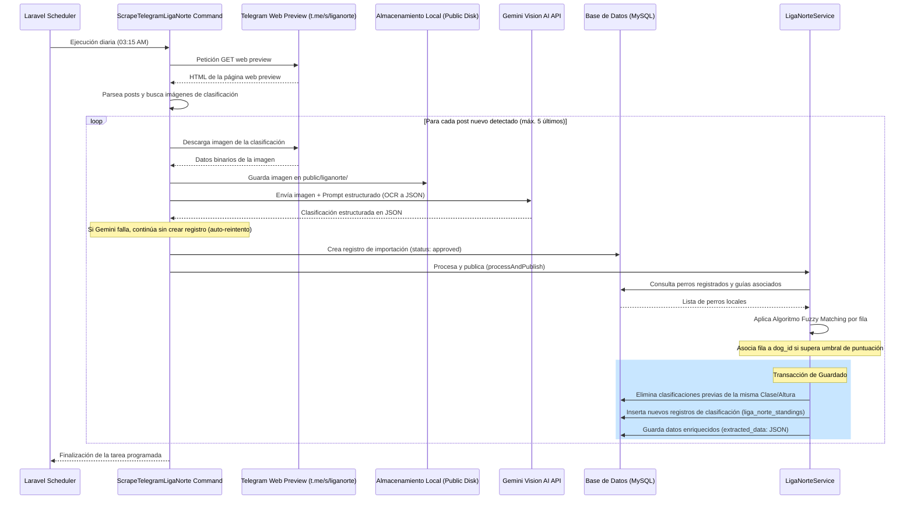

# Integración y Scraping: Clasificaciones Liga Norte (Telegram + Gemini Vision AI)

Este documento detalla el diseño, la arquitectura y el flujo técnico del sistema automatizado de extracción, digitalización y publicación de las clasificaciones de la **Liga Norte de Agility** a partir del canal público de Telegram, utilizando la API de **Gemini Vision AI** y un algoritmo de **mapeo difuso (fuzzy matching)** de binomios.

---

## 📐 Flujo General del Sistema

El proceso está completamente automatizado en el backend (Laravel) y se ejecuta en segundo plano. A grandes rasgos, sigue los siguientes pasos:

1. **Scraping del Canal de Telegram**: Se descarga el HTML público de la vista web del canal de la Liga Norte y se buscan nuevos posts que contengan imágenes de clasificaciones.
2. **Descarga e Intento de Digitalización**: Si hay posts con imágenes no procesadas, se descargan localmente y se envía la imagen a la API de Gemini (modelo `gemini-2.5-flash`) mediante un prompt estructurado para realizar OCR y estructurar las clasificaciones en un array JSON.
3. **Control de Fallos Autocurativo**: Si la llamada a la API de Gemini falla por cualquier motivo (p. ej. error temporal o límite de cuota), se registra el error y **no** se guarda ningún registro en la base de datos. De esta forma, el scraper volverá a intentar digitalizarla automáticamente en la siguiente ejecución programada.
4. **Mapeo Difuso de Binomios (Fuzzy Matching)**: Si la digitalización tiene éxito, se crea el registro de importación directamente con estado `approved`. Luego, se analizan los registros digitalizados y se buscan coincidencias con la base de datos de perros y guías locales de la aplicación utilizando criterios de puntuación (nombres normalizados, pertenencia a club y coincidencia de nombres de guías).
5. **Transacción y Publicación Automática**: Se limpian las clasificaciones antiguas de las alturas procesadas y se guardan los nuevos resultados (con el enlace al `dog_id` correspondiente en caso de coincidencia). Si esta fase de guardado fallara, el registro de importación se elimina para permitir un reintento automático.



---

## ⏰ Programación y Tarea Consola

El comando Artisan que ejecuta el scraper es `liganorte:scrape-telegram` (implementado en [ScrapeTelegramLigaNorte.php](file:///c:/Users/Usuario/Desktop/AgilityAsturiass/agility_back/app/Console/Commands/ScrapeTelegramLigaNorte.php)). 

Está configurado en el programador de Laravel ([console.php](file:///c:/Users/Usuario/Desktop/AgilityAsturiass/agility_back/routes/console.php)) para ejecutarse de forma diaria a las **03:15 AM** (Hora de Madrid):

```php
// Scrape Telegram Liga Norte channel for classification images
Schedule::command('liganorte:scrape-telegram')->dailyAt('03:15')->timezone('Europe/Madrid');
```

---

## 🔬 Extracción de Datos de Telegram

El scraper web no requiere de APIs oficiales de Telegram o bots, ya que consume la versión web preview del canal público:

* **URL Objetivo**: `https://t.me/s/liganorte`
* **Detección de Posts**: El código analiza el HTML buscando atributos `data-post="liganorte/{post_id}"` mediante expresiones regulares para obtener los fragmentos HTML correspondientes a cada post.
* **Extracción de Imágenes**: Dentro del bloque de cada post, busca el contenedor de la imagen `tgme_widget_message_photo_wrap` y extrae la URL de la imagen de fondo declarada en el estilo CSS `background-image`.
* **Deduplicación**: Para evitar trabajos duplicados y consumo excesivo de la API de Gemini, se compara el `telegram_message_id` contra la tabla `liga_norte_imports`. Si ya existe el registro, se omite.
* **Limpieza de Pendientes**: Se eliminan automáticamente registros antiguos que quedaron en estado `pending` y que no figuran en el top 5 de publicaciones más recientes, eliminando también sus imágenes locales para no ocupar espacio en disco.

---

## 🧠 Digitalización con Gemini Vision AI

Una vez descargada la imagen, el comando llama a `GeminiVisionService` (implementado en [GeminiVisionService.php](file:///c:/Users/Usuario/Desktop/AgilityAsturiass/agility_back/app/Services/GeminiVisionService.php)), el cual realiza una petición HTTP POST al modelo **`gemini-2.5-flash`** con las siguientes características:

* **Carga de Datos**: Codifica la imagen local en formato **Base64** y la adjunta en el cuerpo de la petición.
* **Estructura Requerida**: Utiliza la directiva `generationConfig` con `'responseMimeType' => 'application/json'` para forzar a Gemini a devolver un JSON estricto.
* **Prompt OCR Estructurado**: El prompt le indica a la IA que extraiga la tabla de clasificaciones al detalle e ignore textos explicativos del canal. La salida debe ser un array de objetos con los siguientes campos normalizados:
  - `clase` (Altura de salto en cm: 20, 30, 40, 50, 60).
  - `club_nombre` (mayúsculas).
  - `guia_nombre` (mayúsculas).
  - `perro_nombre` (mayúsculas).
  - Puntuaciones detalladas (`agility_ex_0`, `agility_ex_5`, `jumping_ex_0`, `jumping_ex_5`, `total_agility`, `total_jumping`, `puntos_total`, `excelentes_totales`, `excelentes_cero`, `excelentes_cinco`).

---

## 🔗 Algoritmo de Mapeo Difuso (Fuzzy Matching)

Uno de los principales retos es que el nombre de los perros y de los guías escritos a mano en las planillas de la clasificación de la Liga Norte no coinciden exactamente con los de la base de datos (por ejemplo, erratas de escritura, apellidos omitidos, nombres acortados como "Diego Ponga" en vez de "Diego Arbesu").

Para solucionar esto, [LigaNorteService.php](file:///c:/Users/Usuario/Desktop/AgilityAsturiass/agility_back/app/Services/LigaNorteService.php) aplica un algoritmo de scoring difuso sobre cada fila digitalizada comparándola contra todos los perros registrados globalmente:

1. **Normalización de Texto**: Se convierten las cadenas a minúsculas, se eliminan acentos (`á` -> `a`, etc.) y se suprimen todos los caracteres especiales y espacios.
2. **Comparación del Perro**: El nombre del perro digitalizado en la fila debe ser exactamente igual al nombre del perro normalizado de la base de datos (por ejemplo, `"valkyria"` == `"valkyria"`). Si no hay coincidencia exacta de nombre de perro, no se evalúa más y la fila no se vincula.
3. **Puntuación del Guía y Club**: Si el perro coincide, se calcula una puntuación de similitud (`score` inicial en `1`):
   * **Validación de Club (+10 puntos)**: Si el club del perro en la base de datos contiene o está contenido por el club de la fila de clasificación (o su slug), se le otorgan `10` puntos.
   * **Validación de Guía (Propietarios)**:
     * **Sin Guía (+5 puntos)**: Si el perro no tiene propietarios registrados en el sistema, se añaden `5` puntos.
     * **Coincidencia Directa (+20 puntos)**: Si el nombre del propietario normalizado en el sistema contiene o está contenido por el guía de la clasificación, se otorgan `20` puntos (ej. `"diegoarbesu"` y `"diegoponga"` no coincidiría aquí, pero `"alfonso"` y `"alfonsogalan"` sí).
     * **Coincidencia por Overlap de Tokens (+15 puntos)**: Si no hay coincidencia directa, se dividen los nombres en palabras individuales (de al menos 3 letras, quitando acentos). Se busca si comparten algún token/palabra de al menos 4 caracteres. Si existe overlap, se otorgan `15` puntos (ej. el perro "Koko" cuyo dueño es "Diego Arbesu" en la app y figura como "Diego Ponga" en la Liga Norte comparte el token `"diego"`, sumando `15` puntos).
4. **Umbral de Aceptación**: Se requiere una puntuación **mínima de 6** (lo que significa que el perro coincide en nombre y o bien tiene un dueño/club compatible, o no tiene dueños registrados). La propuesta con la puntuación más alta se selecciona y se asigna al campo `dog_id`.

---

## 🗄️ Persistencia de Datos (Transacción)

Para evitar duplicaciones y asegurar la consistencia al actualizar las clasificaciones:

* **Transacción de BD**: Se envuelve todo el guardado en un bloque `DB::transaction`.
* **Deduplicación por Altura**: Antes de insertar las filas procesadas, se extraen las categorías/alturas (`clase`) únicas que se van a procesar de la imagen. Se eliminan previamente todos los registros existentes en `liga_norte_standings` para esas categorías particulares. Esto permite re-importar o actualizar clasificaciones de clases enteras de forma limpia sin afectar a las clases ausentes en la imagen.
* **Inserción**: Se guardan los nuevos registros en `liga_norte_standings`.
* **Actualización del Import**: El registro `liga_norte_imports` se marca en base de datos como `approved` y se almacena en la columna `extracted_data` el JSON enriquecido de la clasificación (incluyendo el `dog_id` y `suggested_dog_name` para auditoría).

---

## 🖥️ Monitor de Administración y Visualización Pública

### 🛠️ Monitor en el Panel de Administración
Los administradores del club disponen de una pestaña llamada **"Eventos de FlowAgility & Liga Norte"** en el panel de control:
* Permite revisar las últimas 100 importaciones de la Liga Norte.
* Muestra el estado del scraping, la fecha y la imagen capturada de Telegram.
* Permite ver los binomios detectados y re-procesar o aprobar manualmente.

### 🌟 Interfaz de Clasificación (UX Premium)
En el menú de **Miembros → Competición → Liga Norte**, los socios disponen de la pantalla de **Clasificación Liga Norte** que destaca por sus ricos detalles visuales:
* **Filtros por Altura/Clase**: Pestañas superiores estilizadas para alternar entre clases `20`, `30`, `40`, `50` y `60`.
* **Diseño Mobile-First Colapsable**: En pantallas móviles, las tarjetas se presentan en formato supercompacto y colapsado (mostrando solo posición, perro, guía y puntos totales). Al tocar sobre una tarjeta, esta se expande con micro-animaciones revelando el desglose detallado de Agility, Jumping y excelentes.
* **Destacado Local**: Los binomios pertenecientes a clubes locales se visualizan en color verde con degradados suaves hacia el blanco, destacándose instantáneamente sobre el resto de competidores.
* **Medallas de Podio**: Las 3 primeras posiciones muestran un círculo estilizado con gradientes metálicos para Oro, Plata y Bronce (en lugar de números planos), mejorando la estética competitiva.
* **Fichas Informativas Integradas**: Al pulsar sobre el nombre del perro, se abre un modal con su información detallada y fotografía oficial, fomentando la interactividad.
