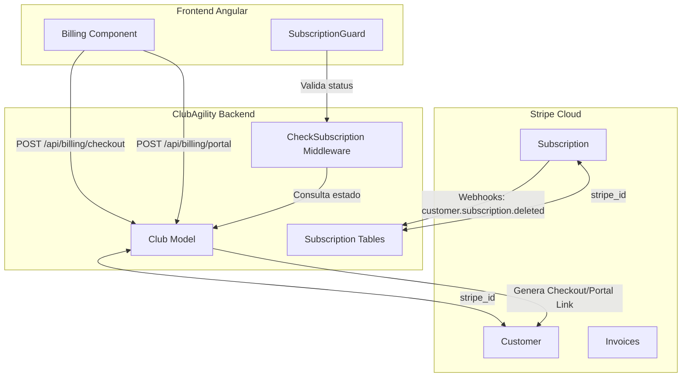

# Integración de Suscripciones SaaS con Stripe

Este documento detalla el diseño técnico y la arquitectura de integración para gestionar y controlar las suscripciones de los clubes a la plataforma **ClubAgility** utilizando la pasarela de pagos **Stripe** y la librería oficial **Laravel Cashier** en el backend.

---

## 1. Arquitectura General y Entidad Facturable

En la arquitectura *Single Database, Multi-Tenant* de ClubAgility, la unidad operativa y aislada es el **Club** (`App\Models\Club`). Por lo tanto, la facturación y el estado de la suscripción se asocian directamente al Club, y no a los usuarios individuales.

*   **Billable Entity:** El modelo `Club` actúa como el cliente facturable en Stripe.
*   **Gestor del Pago:** El usuario con rol `manager` (Responsable del Club) es el encargado de dar de alta el club, configurar el método de pago y gestionar las facturas.
*   **Herramienta de Control:** Se utiliza **Laravel Cashier (Stripe)** para automatizar la sincronización de suscripciones, métodos de pago, cobros y webhooks.
*   **Modelo de Pago Inmediato:** No se ofrecen periodos de prueba gratuitos. El acceso de los clubes está condicionado a la existencia de una suscripción activa de pago desde el registro inicial.



---

## 2. Modelo de Datos y Migraciones (Backend)

Para habilitar Laravel Cashier en el modelo `Club`, se deben añadir las columnas de Stripe y crear las tablas de soporte de suscripción.

### A. Modificación de la Tabla `clubs` (Tenant)
Se agregan los campos necesarios para asociar el club con su correspondiente perfil de cliente en Stripe:

```php
Schema::table('clubs', function (Blueprint $table) {
    $table->string('stripe_id')->nullable()->index();
    $table->string('pm_type')->nullable();
    $table->string('pm_last_four', 4)->nullable();
});
```

### B. Tablas de Laravel Cashier
Se añaden las tablas estándar de Cashier para controlar el estado de las suscripciones a nivel de base de datos:

*   **`subscriptions`**: Registra la suscripción del club, su estado actual y el plan (precio de Stripe) asignado.
*   **`subscription_items`**: Permite asociar múltiples productos/precios a una sola suscripción.

### C. Configuración del Modelo `Club.php`
Se integra el trait `Billable` de Cashier en el modelo:

```php
namespace App\Models;

use Illuminate\Database\Eloquent\Model;
use Laravel\Cashier\Billable;

class Club extends Model
{
    use Billable;

    protected $fillable = [
        'name',
        'slug',
        'domain',
        'logo_url',
        'settings',
        'settings_ranking',
        'plan_id',
        // Stripe fields
        'stripe_id',
        'pm_type',
        'pm_last_four',
    ];
    
    // ...
}
```

---

## 3. Ciclo de Vida del Tenant: Registro y Pago Obligatorio

Para asegurar la viabilidad comercial y el filtrado de registros inactivos, el onboarding requiere el registro de un método de pago y suscripción inmediata:

1.  **Registro Inicial:** El gestor del club rellena el formulario de solicitud en la web comercial principal (`join-saas`).
2.  **Aprovisionamiento de Cuenta:** El backend crea la cuenta del club en base de datos local y el usuario con rol `manager`.
3.  **Redirección Forzada a Pago:** El usuario es redirigido inmediatamente a la pasarela Stripe Checkout. El acceso al panel completo del club permanece bloqueado.
4.  **Activación de la Cuenta:** Una vez completado el pago en Stripe, el backend recibe la confirmación (vía webhook o callback de éxito) y activa la suscripción local. El club queda disponible para su configuración completa.

---

## 4. Flujo de Pago y Redirección a Stripe Checkout (Descuentos de Lanzamiento)

La aplicación ofrece tres planes de suscripción. El **Plan Pro** incluye un descuento automático de lanzamiento durante los dos primeros meses:

*   **Plan Básico:** 29 € / mes (Pago inmediato completo).
*   **Plan Pro (Recomendado):** 49 € / mes (Precio de lanzamiento: **19 € / mes durante los primeros 2 meses**, luego 49 € / mes).
*   **Plan Élite:** 79 € / mes (Pago inmediato completo).

### Integración de Stripe Coupons

Para gestionar la oferta de lanzamiento del Plan Pro, se utiliza la funcionalidad nativa de **Cupones de Stripe**. 

1.  **Configuración en Stripe:** Se crea un cupón con duración de 2 meses y un descuento mensual de 30 € (dejando el precio neto del Plan Pro en 19 €/mes).
2.  **Lógica del Checkout en Backend (`POST /api/billing/checkout`):**
    ```php
    public function checkout(Request $request)
    {
        $club = app('active_club');
        $planSlug = $request->input('plan_slug');
        $priceId = config("cashier.plans.{$planSlug}.price_id");

        $subscription = $club->newSubscription('default', $priceId);

        // Si selecciona el Plan Pro, aplicamos automáticamente el cupón de la oferta de lanzamiento
        if ($planSlug === 'profesional') {
            $couponId = config('cashier.plans.profesional.coupon_id'); // Cupón de Stripe
            $subscription->withCoupon($couponId);
        }

        return $subscription->checkout([
            'success_url' => route('billing.success', ['slug' => $club->slug]),
            'cancel_url' => route('billing.index', ['slug' => $club->slug]),
        ]);
    }
    ```
3.  **Redirección y Pago:** El gestor es redirigido a la pasarela segura de Stripe, donde ve el desglose del descuento aplicado (paga 20 € hoy, y se le informa del cambio a 50 € a partir del tercer mes).
4.  **Confirmación:** Stripe procesa el cargo inicial y redirige de vuelta al club.

---

## 5. Portal de Facturación Autogestionado (Stripe Customer Portal)

No se implementa un CRUD de tarjetas ni descarga local de facturas. Se delega al **Stripe Customer Portal**.

*   **Acceso:** En la sección de Configuración > Suscripción del club, el gestor dispone del botón **Gestionar Facturación**.
*   **Generación del Enlace:** El backend expone el endpoint `POST /api/billing/portal` que devuelve una URL temporal y firmada:
    ```php
    public function portal(Request $request)
    {
        $club = app('active_club');
        return response()->json([
            'url' => $club->billingPortalUrl(route('billing.index', ['slug' => $club->slug]))
        ]);
    }
    ```
*   **Acciones en el Portal:** El gestor puede:
    *   Añadir o cambiar tarjetas de crédito.
    *   Ver el precio del plan activo y la próxima fecha de renovación.
    *   **Cancelar la suscripción:** La cancelación programará la baja de la suscripción para el final del ciclo de facturación actual.
    *   Consultar e imprimir facturas anteriores.

---

## 6. Control de Acceso y Middleware de Bloqueo

El middleware de protección `CheckSubscriptionActive` verifica estrictamente la existencia de una suscripción activa.

### A. Lógica del Middleware

Este middleware intercepta las peticiones de todos los usuarios pertenecientes al club (excepto rutas públicas y endpoints de facturación):

```php
namespace App\Http\Middleware;

use Closure;
use Illuminate\Http\Request;

class CheckSubscriptionActive
{
    public function handle(Request $request, Closure $next)
    {
        $club = app('active_club');

        // Validar únicamente que cuente con una suscripción activa
        if ($club->subscribed('default')) {
            return $next($request);
        }

        // Si la suscripción está suspendida/expirada:
        if ($request->user() && $request->user()->role === 'manager') {
            // El Gestor puede acceder únicamente para regularizar la situación.
            // Si intenta ir a endpoints no relacionados con facturación, recibe 402 Payment Required
            if (!$request->is('api/billing/*') && !$request->is('api/tenant/info')) {
                return response()->json([
                    'error' => 'subscription_expired',
                    'message' => 'Tu periodo de suscripción ha expirado. Por favor, regulariza el pago.'
                ], 402);
            }
            return $next($request);
        }

        // Socios y Staff son bloqueados con 403 Forbidden en cualquier petición privada
        return response()->json([
            'error' => 'club_suspended',
            'message' => 'El acceso a la aplicación de este club está temporalmente suspendido.'
        ], 403);
    }
}
```

### B. Aplicación en Rutas (`api.php`)
El middleware se inyecta en el grupo general de rutas autenticadas:

```php
Route::middleware(['auth:sanctum', 'subscription.active'])->group(function () {
    // Rutas de reservas, perros, vídeos, salud, etc.
});
```

---

## 7. Sincronización mediante Webhooks de Stripe

Los webhooks permiten recibir notificaciones de eventos ocurridos directamente en Stripe (ej: un fallo en el cobro recurrente de la suscripción mensual) para actualizar nuestra base de datos.

Se configura la ruta `/api/webhooks/stripe` redirigida al webhook oficial de Cashier:

```
POST https://api.clubagility.com/api/webhooks/stripe
```

### Eventos Clave a Escuchar:

1.  **`invoice.payment_succeeded`**:
    *   **Acción:** Confirma el cobro de la mensualidad. El sistema extiende la vigencia de la suscripción local.
2.  **`invoice.payment_failed`**:
    *   **Acción:** Registra el impago de la suscripción.
    *   **Comportamiento de Gracia:** Cashier cambia el estado a `past_due`. El club entra en un "periodo de gracia" de 3 días donde se envía un email automático al gestor solicitando la actualización de la tarjeta. Transcurrido este tiempo, Stripe reintenta el cobro. Si falla definitivamente, la suscripción pasa a `unpaid` y se bloquea el acceso al club.
3.  **`customer.subscription.deleted`**:
    *   **Acción:** Ocurre cuando la suscripción se cancela definitivamente.
    *   **Comportamiento:** El backend rebaja el `plan_id` del club o suspende el acceso del club de forma definitiva, impidiendo cualquier operación.

---

## 8. Interfaz de Usuario y Guards (Frontend Angular)

El frontend de Angular maneja la experiencia de usuario relacionada con los pagos e impide la navegación libre si se detecta un estado de impago o expiración.

### A. Vista de Facturación (`/configuracion/facturacion`)
Un componente premium exclusivo para administradores/gestores del club que muestra:
*   **Tarjeta de Resumen:** Nombre del plan activo, precio mensual y fecha de renovación.
*   **Desglose Promocional:** Si el club está en el periodo de descuento (meses 1 y 2 del plan Pro), muestra un banner aclaratorio informando del descuento y de la fecha de paso al precio regular.
*   **Sección de Acciones:**
    *   Botón *Suscribirse ahora* (redirige a Stripe Checkout si está Caducado).
    *   Botón *Gestionar Datos de Facturación* (llama al endpoint para redirigir al Stripe Customer Portal).
*   **Historial de Facturas:** Tabla que consulta a `GET /api/billing/invoices` y permite ver un listado básico con links de descarga rápida en formato PDF.

### B. Interceptores de Red y Guards de Ruta

*   **`SubscriptionGuard`**: Protege las rutas principales de Angular (`reservas`, `perros`, `salud`, `videos`, etc.). Si la información cargada en el `TenantService` devuelve que el club está en estado inactivo/impago:
    *   Si el usuario actual es `manager`, le fuerza a redirigirse a la vista de facturación (`/configuracion/facturacion`).
    *   Si el usuario es `member` o `staff`, le redirige a `/suscripcion-suspendida`.
*   **`SubscriptionSuspendedComponent`**: Pantalla a pantalla completa que se muestra a los socios si el club no paga. Ofrece una estética limpia (modo oscuro, gradientes sutiles) con el lema del club suspendido e instrucciones para que se pongan en contacto con la directiva del club para volver a activar el servicio.
*   **HTTP Interceptor**: Si la API devuelve un código **402 Payment Required**, el interceptor de Angular captura el error y redirige inmediatamente al usuario a la página de facturación.
