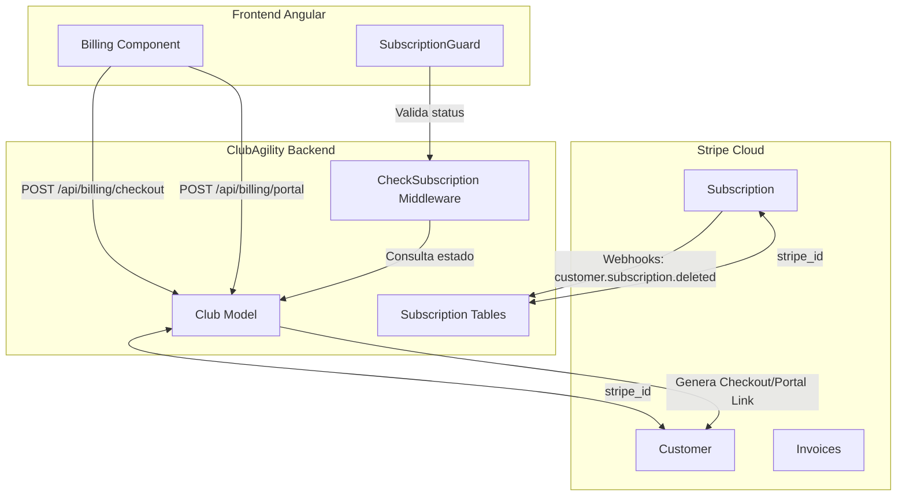

# Integración de Suscripciones SaaS con Stripe

Este documento detalla el diseño técnico, la arquitectura de integración y las guías de resolución de problemas para gestionar y controlar las suscripciones de los clubes a la plataforma **ClubAgility** utilizando la pasarela de pagos **Stripe** y la librería oficial **Laravel Cashier** en el backend.

---

## 1. Arquitectura General y Entidad Facturable

En la arquitectura *Single Database, Multi-Tenant* de ClubAgility, la unidad operativa y aislada es el **Club** ([Club](file:///c:/Users/Usuario/Desktop/AgilityAsturiass/agility_back/app/Models/Club.php)). Por lo tanto, la facturación y el estado de la suscripción se asocian directamente al Club, y no a los usuarios individuales.

*   **Billable Entity:** El modelo `Club` actúa como el cliente facturable en Stripe.
*   **Gestor del Pago:** El usuario con rol `manager` (Responsable del Club) es el encargado de dar de alta el club, configurar el método de pago y gestionar las facturas.
*   **Herramienta de Control:** Se utiliza **Laravel Cashier (Stripe)** para automatizar la sincronización de suscripciones, métodos de pago, cobros y webhooks.
*   **Modelo de Pago Inmediato:** No se ofrecen periodos de prueba gratuitos. El acceso de los clubes está condicionado a la existencia de una suscripción activa de pago desde el registro inicial.



---

## 2. Modelo de Datos y Migraciones (Backend)

Para habilitar Laravel Cashier en el modelo `Club`, se deben añadir las columnas de Stripe y crear las tablas de soporte de suscripción.

### A. Modificación de la Tabla `clubs` (Tenant)
Se agregan los campos necesarios para asociar el club con su correspondiente perfil de cliente en Stripe:

```php
Schema::table('clubs', function (Blueprint $table) {
    $table->string('stripe_id')->nullable()->index();
    $table->string('pm_type')->nullable();
    $table->string('pm_last_four', 4)->nullable();
});
```

### B. Tablas de Laravel Cashier
Se añaden las tablas estándar de Cashier para controlar el estado de las suscripciones a nivel de base de datos:

*   **`subscriptions`**: Registra la suscripción del club, su estado actual y el plan (precio de Stripe) asignado.
*   **`subscription_items`**: Permite asociar múltiples productos/precios a una sola suscripción.

### C. Configuración del Modelo `Club.php`
Se integra el trait `Billable` de Cashier en el modelo y se configura el modelo de cliente en `AppServiceProvider.php` usando `Cashier::useCustomerModel(Club::class)`:

```php
namespace App\Models;

use Illuminate\Database\Eloquent\Model;
use Laravel\Cashier\Billable;

class Club extends Model
{
    use Billable;

    protected $fillable = [
        'name',
        'slug',
        'domain',
        'logo_url',
        'settings',
        'settings_ranking',
        'plan_id',
        // Stripe fields
        'stripe_id',
        'pm_type',
        'pm_last_four',
    ];
    
    // ...
}
```

---

## 3. Ciclo de Vida del Tenant: Registro y Aprovisionamiento Tras el Pago

Desde el rediseño de 2026-06-11, **el club NO se crea hasta que Stripe confirma el pago**. El formulario de registro solo crea un `ClubLead` y todo el aprovisionamiento ocurre en el webhook:

1.  **Registro Inicial:** El gestor del club rellena el formulario de solicitud en la web comercial principal (`join-saas`).
2.  **Creación del Lead:** El backend ([ClubLeadController.php](file:///c:/Users/Usuario/Desktop/AgilityAsturiass/agility_back/app/Http/Controllers/ClubLeadController.php)) crea únicamente un registro `ClubLead` con estado `pending`, guardando la contraseña elegida **ya hasheada** en la columna `club_leads.password`. No se crea club, ni usuario, ni SSL, ni se envía ningún correo todavía.
3.  **Redirección a Stripe Checkout:** Se genera una sesión de Checkout en modo `subscription` directamente con el cliente de Stripe (`Cashier::stripe()->checkout->sessions->create(...)`, sin entidad billable aún), incluyendo `club_lead_id` en los `metadata` de la sesión y de la suscripción, `customer_email` prellenado y el cupón de lanzamiento si el plan es Pro. El usuario es redirigido a la pasarela. Si la creación de la sesión falla, se devuelve un 500 y el lead queda en `pending` (reintentable).
4.  **Aprovisionamiento vía Webhook:** Al completarse el pago, Cashier dispara el evento `WebhookReceived` y el listener [StripeEventListener.php](file:///c:/Users/Usuario/Desktop/AgilityAsturiass/agility_back/app/Listeners/StripeEventListener.php) procesa **`checkout.session.completed`**: localiza el lead por los metadatos y delega en [ClubProvisioningService.php](file:///c:/Users/Usuario/Desktop/AgilityAsturiass/agility_back/app/Services/ClubProvisioningService.php), que crea el club (con `stripe_id` del cliente de la sesión), el usuario `manager` (copiando el hash de contraseña del lead), los settings por plan, **envía el correo de activación al gestor y el aviso al admin**, notifica a los admins en base de datos y lanza la generación del SSL. El lead pasa a `approved` con `provisioned_at` y `club_id` (idempotente ante reintentos del webhook).
5.  **Sincronización de la Suscripción:** Como el webhook `customer.subscription.created` suele llegar **antes** de que el club exista (y Cashier lo descarta al no encontrar el billable), el propio listener recupera la suscripción de Stripe y crea el registro local (`subscriptions` + `subscription_items`). Si esta sincronización fallara, el siguiente `customer.subscription.updated` del ciclo de vida la crearía vía Cashier.
6.  **Retorno y Animación:** Stripe redirige al usuario a la landing con `stripe_success=true&slug=...`. La animación de aprovisionamiento sondea `GET /api/club-leads/status/{slug}`, que devuelve 404 mientras el webhook no haya creado el club (el frontend tolera el error y sigue sondeando) y `ready: true` cuando el club existe y el SSL responde.

> [!NOTE]
> **Casos de conflicto:** si entre el registro y el pago otro lead ocupa el mismo slug/email (o el aprovisionamiento falla por cualquier motivo), el listener marca el lead con estado `error`, lo registra en logs y envía un correo a `config('mail.admin_address')` para gestión manual (posible reembolso desde el Dashboard de Stripe).
>
> **Flujo con bypass activo** (`STRIPE_BYPASS_SUBSCRIPTIONS=true`, estado actual de producción): no hay pago, y `ClubLeadController@store` aprovisiona inmediatamente con el mismo `ClubProvisioningService` (correo de activación incluido), devolviendo `stripe_checkout_url: null`.

---

## 4. Flujo de Pago y Redirección a Stripe Checkout (Descuentos de Lanzamiento)

La aplicación ofrece tres planes de suscripción. El **Plan Pro** incluye un descuento automático de lanzamiento durante los dos primeros meses:

*   **Plan Básico:** 29 € / mes (Precio Stripe: `STRIPE_PRICE_BASICO`).
*   **Plan Pro (Recomendado):** 49 € / mes (Precio Stripe: `STRIPE_PRICE_PRO` con el cupón `STRIPE_COUPON_PRO_LAUNCH`, que rebaja la cuota a **19 € / mes durante los primeros 2 meses**).
*   **Plan Élite:** 79 € / mes (Precio Stripe: `STRIPE_PRICE_ELITE`).

### Configuración de Precios y Cupones (config() obligatorio, nunca env())

> [!IMPORTANT]
> **Nunca leer variables de Stripe con `env()` en runtime.** En producción la configuración está cacheada (`php artisan config:cache`) y `env()` devuelve `null`, rompiendo el checkout en silencio (este bug ya ocurrió con el flag de bypass y con los Price IDs). Todas las claves de Stripe se exponen a través de `config/services.php` y se leen con `config()`:

```php
// config/services.php
'stripe' => [
    'bypass_subscriptions' => env('STRIPE_BYPASS_SUBSCRIPTIONS', false) || env('BYPASS_SUBSCRIPTIONS', false),
    'prices' => [
        'basico' => env('STRIPE_PRICE_BASICO'),
        'profesional' => env('STRIPE_PRICE_PRO'),
        'elite' => env('STRIPE_PRICE_ELITE'),
    ],
    'coupon_pro_launch' => env('STRIPE_COUPON_PRO_LAUNCH'),
],
```

### Lógica del Checkout en Backend (`POST /api/billing/checkout`):

Se encuentra definida en [BillingController.php](file:///c:/Users/Usuario/Desktop/AgilityAsturiass/agility_back/app/Http/Controllers/BillingController.php):

```php
public function checkout(Request $request)
{
    $user = $request->user();
    if ($user->role !== 'manager' && $user->role !== 'admin') {
        return response()->json(['message' => 'No autorizado.'], 403);
    }

    $club = app()->bound('active_club_id') ? Club::find(app('active_club_id')) : $user->club;

    $validated = $request->validate([
        'plan_slug' => 'required|string|in:basico,profesional,elite',
    ]);

    $planSlug = $validated['plan_slug'];
    $priceId = config("services.stripe.prices.{$planSlug}");

    $subscription = $club->newSubscription('default', $priceId);

    if ($planSlug === 'profesional') {
        $couponId = config('services.stripe.coupon_pro_launch');
        if ($couponId) {
            $subscription->withCoupon($couponId);
        }
    }

    $host = $request->getHost();
    $scheme = $request->secure() ? 'https' : 'http';
    $successUrl = "{$scheme}://{$host}/configuracion/facturacion?success=true&session_id={CHECKOUT_SESSION_ID}";
    $cancelUrl = "{$scheme}://{$host}/configuracion/facturacion?cancel=true";

    $checkoutSession = $subscription->checkout([
        'success_url' => $successUrl,
        'cancel_url' => $cancelUrl,
    ]);

    return response()->json(['url' => $checkoutSession->url]);
}
```

---

## 5. Portal de Facturación Autogestionado (Stripe Customer Portal) e Invoices

La gestión de tarjetas, cambios de plan y descargas de facturas se delega al **Stripe Customer Portal** y a endpoints específicos del backend.

*   **Acceso:** En la sección de Configuración > Facturación del club, el gestor dispone del botón **Gestionar en Stripe**.
*   **Generación del Enlace:** El backend expone el endpoint `POST /api/billing/portal` que devuelve una URL temporal y firmada del portal de Stripe.
*   **Historial de Facturas:** La vista de facturación carga el listado de facturas consultando a `GET /api/billing/invoices`.
    > [!IMPORTANT]
    > **Resolución de Errores de Invoices (500 Error):**
    > Anteriormente, el formateo del total de la factura realizaba operaciones matemáticas sobre un string con formato de moneda, lo cual fallaba. Ahora se retorna `$invoice->total()` directamente de Laravel Cashier para evitar errores de parseo de moneda en el backend.
*   **Descarga de Facturas:** El frontend descarga el PDF mediante `HttpClient` (`responseType: 'blob'`) contra el endpoint `/api/billing/invoices/{invoice}/download` y dispara la descarga local con un enlace temporal (`URL.createObjectURL`).
    > [!IMPORTANT]
    > **Por qué la descarga se hace vía HttpClient y no con `window.open`:**
    > La autenticación del frontend es por token Bearer (interceptor de Angular), no por cookie de sesión. Abrir el endpoint en una pestaña nueva no envía el header `Authorization` y `auth:sanctum` responde 401. Además, la URL absoluta que generaba el backend con `route()` no incluía el prefijo `/backend` del proxy Nginx de producción. Por ambos motivos, el frontend construye la URL a partir de `environment.apiUrl` y descarga el blob con el interceptor de autenticación.
    > [!IMPORTANT]
    > **Firma del Endpoint de Descarga:**
    > La firma del método en [BillingController.php](file:///c:/Users/Usuario/Desktop/AgilityAsturiass/agility_back/app/Http/Controllers/BillingController.php#L190) se simplificó a `downloadInvoice(Request $request, $invoice)` para asegurar que el parámetro coincida de manera exacta con el marcador `{invoice}` de la ruta `/api/billing/invoices/{invoice}/download` definida en `api.php`. Esto evita errores de inyección y de coincidencia de parámetros en Laravel.

---

## 6. Control de Acceso y Middleware de Bloqueo

El middleware de protección [CheckSubscriptionActive.php](file:///c:/Users/Usuario/Desktop/AgilityAsturiass/agility_back/app/Http/Middleware/CheckSubscriptionActive.php) verifica estrictamente la existencia de una suscripción activa.

### Lógica del Middleware:
Este middleware intercepta las peticiones de todos los usuarios pertenecientes al club (excepto rutas públicas y endpoints exentos):

```php
namespace App\Http\Middleware;

use Closure;
use Illuminate\Http\Request;
use App\Models\Club;

class CheckSubscriptionActive
{
    public function handle(Request $request, Closure $next)
    {
        $club = app()->bound('active_club_id') ? Club::find(app('active_club_id')) : null;
        if (!$club && $request->user()) {
            $club = $request->user()->club;
        }

        // Bypass en entorno de testing (salvo que el test pida la comprobación explícitamente)
        if (app()->environment('testing') && !$request->hasHeader('X-Test-Check-Subscription')) {
            return $next($request);
        }

        // Bypass global de suscripciones (ver sección "Bypass temporal" más abajo)
        if (config('services.stripe.bypass_subscriptions')) {
            return $next($request);
        }

        // Si no hay club (consola/seeder) o el usuario es admin global, permitir libre acceso
        if (!$club || ($request->user() && $request->user()->role === 'admin')) {
            return $next($request);
        }

        // Verificar si el club tiene la suscripción activa
        if ($club->subscribed('default')) {
            return $next($request);
        }

        // Si la suscripción no está activa:
        if ($request->user()) {
            if ($request->user()->role === 'manager') {
                // El Gestor puede acceder únicamente a endpoints de facturación, info de club, sesión o usuario
                if ($request->is('api/billing/*') || $request->is('api/tenant/info') || $request->is('api/logout') || $request->is('api/user')) {
                    return $next($request);
                }

                return response()->json([
                    'error' => 'subscription_expired',
                    'message' => 'La suscripción del club ha expirado. Por favor, realiza el pago para reactivar el servicio.'
                ], 402);
            }
        }

        // Socios y Staff son bloqueados con 403 Forbidden en cualquier petición privada
        return response()->json([
            'error' => 'club_suspended',
            'message' => 'El acceso a la aplicación de este club está temporalmente suspendido.'
        ], 403);
    }
}
```

### Bypass temporal de suscripciones (`STRIPE_BYPASS_SUBSCRIPTIONS`)

Existe un interruptor de emergencia para desactivar globalmente el control de suscripciones, leído desde `config('services.stripe.bypass_subscriptions')` (variables `STRIPE_BYPASS_SUBSCRIPTIONS` o `BYPASS_SUBSCRIPTIONS` en `.env`). Mientras está activo:

*   El middleware `CheckSubscriptionActive` deja pasar **todas** las peticiones sin comprobar la suscripción.
*   El endpoint `GET /api/billing/status` reporta `subscribed: true` y `stripe_status: active` aunque no exista suscripción real.
*   **El registro de clubes nuevos (`join-saas`) se salta por completo el Checkout de Stripe**: el club se aprovisiona sin cliente ni suscripción en Stripe. Al desactivar el bypass, esos clubes quedarán bloqueados y su gestor deberá completar el pago desde Configuración > Facturación.

> [!WARNING]
> Este bypass es una medida **temporal** para evitar bloqueos en producción. Mientras esté activo no se factura a ningún club. Recordar desactivarlo (`STRIPE_BYPASS_SUBSCRIPTIONS=false` + `php artisan config:cache`) en cuanto se estabilice el flujo de pagos.

---

## 7. Sincronización y Pruebas con Webhooks de Stripe

Los webhooks permiten recibir notificaciones de eventos ocurridos en Stripe para actualizar la base de datos de forma asíncrona.

*   **Ruta local del Webhook:** `/api/webhooks/stripe`.
*   **Ruta del Webhook en producción:** `https://clubagility.com/backend/api/webhooks/stripe` — Nginx proxifica la API bajo el prefijo `/backend`, así que al dar de alta el endpoint en el Dashboard de Stripe hay que incluirlo (la URL sin `/backend` devuelve un 405 de Nginx).
    > [!WARNING]
    > **Estado actual de producción (comprobado el 2026-06-11):** el `.env` de producción solo define `STRIPE_BYPASS_SUBSCRIPTIONS`; faltan `STRIPE_KEY`, `STRIPE_SECRET`, `STRIPE_WEBHOOK_SECRET` y los `STRIPE_PRICE_*`. El endpoint del webhook acepta hoy peticiones sin firmar (verificado: un POST falso devuelve HTTP 200). Antes de desactivar el bypass: definir todas las variables, dar de alta el endpoint en el Dashboard de Stripe, copiar su `whsec_...` y ejecutar `php artisan config:cache` (la config está cacheada en el servidor).
*   **Pruebas en Entorno Local (Laravel Herd):** Como Herd sirve la aplicación en puerto 80 a través de Nginx (`http://agility_back.test`), la herramienta Stripe CLI debe configurarse para redirigir los eventos a ese dominio virtual y no al puerto por defecto 8000.
    > [!IMPORTANT]
    > **Prefijo HTTP Obligatorio:**
    > Al configurar el comando de reenvío de webhooks localmente, debes especificar la URL completa incluyendo el esquema `http://`. De lo contrario, Stripe CLI fallará o ignorará el envío:
    > ```bash
    > stripe listen --forward-to http://agility_back.test/api/webhooks/stripe
    > ```
*   **Firma del Secreto:** El valor de `STRIPE_WEBHOOK_SECRET` impreso al iniciar `stripe listen` (con formato `whsec_...`) debe copiarse fielmente al archivo `.env` del backend para validar y procesar las firmas de los webhooks entrantes.
    > [!WARNING]
    > **La verificación de firma es opcional para Cashier:** si `STRIPE_WEBHOOK_SECRET` no está definido, el `WebhookController` de Cashier **acepta los webhooks sin verificar la firma**, lo que permitiría falsificar eventos de suscripción. Es imprescindible que esta variable esté definida en producción (con el secreto del endpoint configurado en el Dashboard de Stripe, no el de `stripe listen`).

---

## 8. Interfaz de Usuario y Guards (Frontend Angular)

### A. Guards de Ruta y Contexto de Inyección (toObservable)
En Angular 18+, los guards asíncronos (`async/await`) pierden el contexto de inyección tras un `await`. Para evitar errores `NG0203` al usar `toObservable()`, los guards (como [subscription-active.guard.ts](file:///c:/Users/Usuario/Desktop/AgilityAsturiass/frontend/src/app/guards/subscription-active.guard.ts)) capturan el `Injector` síncronamente al inicio del método y lo pasan explícitamente como opción al transformar señales a observables:
```typescript
const injector = inject(Injector);

// Esperar a que cargue la autenticación si está en proceso
if (authService.checkAuthLoading()) {
    await firstValueFrom(
        toObservable(authService.checkAuthLoading, { injector }).pipe(
            filter(loading => !loading)
        )
    );
}
```

### B. Mitigación de Errores 402 en la Consola
Para evitar que se realicen llamadas HTTP innecesarias que resulten en errores molestos de tipo `402 (Payment Required)` en la consola del navegador cuando el club está bloqueado, los servicios de frontend (tales como [DogService](file:///c:/Users/Usuario/Desktop/AgilityAsturiass/frontend/src/app/services/dog.service.ts), [NotificationService](file:///c:/Users/Usuario/Desktop/AgilityAsturiass/frontend/src/app/services/notification.service.ts) y [OnboardingService](file:///c:/Users/Usuario/Desktop/AgilityAsturiass/frontend/src/app/services/onboarding.ts)) inyectan `TenantService` y cancelan preventivamente sus peticiones si la suscripción está inactiva:
```typescript
if (this.tenantService.tenantInfo()?.subscribed === false) {
    return; // Cancela la petición antes de realizar la llamada HTTP
}
```

### C. Protección de la Ruta Raíz
La ruta raíz `/` (asociada al `HomeComponent` del subdominio) incluye el guard `subscriptionActiveGuard`. Esto asegura que los usuarios de clubes suspendidos no puedan permanecer en la página de bienvenida y sean redirigidos de inmediato a la sección de facturación (si son Gestores) o a la pantalla de suspensión de servicio (`/suscripcion-suspendida`) en caso de socios o entrenadores.

---

## 9. Solución de Problemas y Guía de Desarrollo Local (FAQ & Troubleshooting)

### P: El pago en Stripe simulado fue correcto, pero al loguearme me sigue saliendo "Se requiere una suscripción activa". ¿Qué pasa?
**R:** Esto se debe casi con total seguridad a que el backend local no está recibiendo los webhooks de Stripe. En desarrollo local, Stripe no puede conectarse a tu máquina directamente. Tienes que arrancar la utilidad Stripe CLI:
1.  Asegúrate de tener Stripe CLI instalado.
2.  Ejecuta: `stripe listen --forward-to http://agility_back.test/api/webhooks/stripe`
3.  Copia el secreto devuelto (`whsec_...`) en tu `.env` bajo `STRIPE_WEBHOOK_SECRET`.
4.  Realiza de nuevo una simulación de registro y pago, o provoca un cobro exitoso ficticio con `stripe trigger checkout.session.completed`.

### P: ¿Cómo puedo simular o activar manualmente la suscripción de un Club localmente sin usar Webhooks?
**R:** Si no tienes conexión a internet o quieres saltarte la verificación de Stripe de forma manual para probar otras partes de la aplicación, puedes simular la suscripción activa ejecutando la siguiente línea de código en **Tinker** (`php artisan tinker`) o en un script de desarrollo:

```php
$club = \App\Models\Club::where('slug', 'asturias-test')->first();
$club->subscriptions()->create([
    'type' => 'default',
    'stripe_id' => 'sub_mock_' . uniqid(),
    'stripe_status' => 'active',
    'stripe_price' => config('services.stripe.prices.profesional'),
    'quantity' => 1,
]);
```
Esto creará un registro de suscripción ficticio de estado `active` asociado al club, desbloqueando inmediatamente todos sus endpoints protegidos.

### P: Tengo errores del tipo "NG0203: toObservable() can only be used within an injection context..." al navegar por las páginas.
**R:** Este error ocurre en Angular cuando intentas utilizar la reactividad de señales a observables (`toObservable`) después de realizar operaciones asíncronas (`await`). Asegúrate de que los guards de tu ruta sigan el patrón de inyección síncrona del `Injector` al inicio del guard y lo pasen explícitamente como opción al observable, tal y como se detalla en la **Sección 8.A** de este documento.

---

## 10. Clubes Huérfanos y Rediseño Pendiente del Aprovisionamiento

### 🚨 REGLA CRÍTICA: NUNCA borrar los clubes existentes

> [!DANGER]
> **Los clubes que ya están en producción son los primeros y más importantes clientes de la plataforma y llevan meses almacenando datos.** A fecha 2026-06-11 son (id / slug / alta): `1 agilityasturias` (24-abr), `2 patitas` (24-abr), `3 xanastur` (5-may), `4 leonidogs` (5-may), `5 elnorte` (7-may) y `24 miperro10` (31-may).
>
> Reglas inquebrantables para cualquier desarrollo futuro relacionado con suscripciones o limpieza de datos:
>
> 1. **"No tener suscripción ni `stripe_id` NUNCA es criterio de borrado.** Todos los clubes existentes se crearon antes de la integración de Stripe (o bajo el bypass) y por tanto no tienen ni cliente de Stripe ni suscripción local. Un job que borre "clubes sin suscripción" los destruiría todos.
> 2. **Prohibido implementar jobs/comandos de limpieza automática que ejecuten `Club::delete()`.** Cualquier limpieza de clubes huérfanos debe ser manual, club por club, revisada por una persona.
> 3. **`Club::delete()` es devastador y irreversible:** el hook `booted()` de [Club.php](file:///c:/Users/Usuario/Desktop/AgilityAsturiass/agility_back/app/Models/Club.php) borra en cascada todos los vídeos, fotos, perros y usuarios del club, **incluyendo los archivos remotos en Bunny.net y Mega S4**. No hay papelera ni soft-delete.
> 4. **Antes de cualquier operación masiva sobre la tabla `clubs`, hacer backup** (ver [[backups-locales]]) y probar primero en local.

### El problema histórico de los clubes huérfanos (resuelto el 2026-06-11)

En el flujo de registro original, el club, el usuario `manager`, el email de activación y el certificado SSL se generaban **antes** de que el usuario pagara. Si el checkout de Stripe se abandonaba:

*   El **slug quedaba secuestrado** (`unique:clubs,slug`) y el **email bloqueado** (`unique:users,email`): la misma persona no podía reintentar el registro desde el formulario.
*   Se acumulaban **certificados SSL de clubes fantasma** (Let's Encrypt limita ~50 certificados nuevos por dominio y semana).

### Rediseño implementado (2026-06-11): aprovisionar solo tras el pago

El onboarding se rediseñó tal y como estaba decidido — ver la **Sección 3** para el flujo completo:

*   El formulario `join-saas` solo crea el `ClubLead` (con la contraseña hasheada en `club_leads.password`). Un checkout abandonado deja un lead `pending` inocuo: no reserva slug ni email, no genera SSL y permite reintentar el registro.
*   El checkout de Stripe se crea directamente a partir del lead (sin `Club` billable aún), con `club_lead_id` en los metadatos; el aprovisionamiento ocurre en [StripeEventListener.php](file:///c:/Users/Usuario/Desktop/AgilityAsturiass/agility_back/app/Listeners/StripeEventListener.php) (evento `WebhookReceived` de Cashier) usando [ClubProvisioningService.php](file:///c:/Users/Usuario/Desktop/AgilityAsturiass/agility_back/app/Services/ClubProvisioningService.php).
*   El email de activación con el token de reset se envía **tras el pago** (o inmediatamente en el flujo con bypass).
*   La animación de aprovisionamiento de la landing no necesitó cambios: el sondeo de `GET /api/club-leads/status/{slug}` tolera el 404 mientras el webhook no haya creado el club y sigue sondeando.
*   La migración del flujo **no tocó los clubes existentes** (ver regla crítica): solo afecta a registros nuevos. Columnas nuevas en `club_leads`: `password`, `stripe_session_id`, `club_id`, `provisioned_at` (requiere `php artisan migrate` al desplegar).
*   Pueden quedar leads abandonados acumulándose en `club_leads` (estado `pending` sin `provisioned_at`); son inofensivos y visibles en el panel de administración para limpieza manual.

---

## 11. Checklist: qué falta para que la integración funcione al 100% en producción

**Estado a 2026-06-11:** el código del flujo completo (lead → checkout → webhook → aprovisionamiento → correo de activación → suscripción local) está **desplegado y probado end-to-end en local** con claves de test (pago real simulado con `4242...`, webhook vía `stripe listen`, correo y suscripción verificados). En producción sigue **dormido bajo el bypass** (`STRIPE_BYPASS_SUBSCRIPTIONS=true`): los registros nuevos se aprovisionan sin pago, como hasta ahora.

Pasos pendientes, en orden, para activar el cobro real:

1. **Dashboard de Stripe (modo live):**
   - [ ] Crear los 3 productos con sus precios recurrentes mensuales: Básico 29 €, Pro 49 €, Élite 79 €.
   - [ ] Crear el cupón de lanzamiento del Plan Pro (rebaja a 19 €/mes los 2 primeros meses).
   - [ ] Dar de alta el endpoint del webhook: `https://clubagility.com/backend/api/webhooks/stripe` (⚠️ con el prefijo `/backend`). Eventos mínimos: `checkout.session.completed`, `customer.subscription.created`, `customer.subscription.updated`, `customer.subscription.deleted`, `invoice.payment_succeeded`, `invoice.payment_failed`. Copiar el `whsec_...` del endpoint.
2. **`.env` del servidor** (`/var/www/agilityasturias/agility_back/.env`):
   - [ ] `STRIPE_KEY` (pk_live), `STRIPE_SECRET` (sk_live), `STRIPE_WEBHOOK_SECRET` (whsec del paso anterior).
   - [ ] `STRIPE_PRICE_BASICO`, `STRIPE_PRICE_PRO`, `STRIPE_PRICE_ELITE`, `STRIPE_COUPON_PRO_LAUNCH`.
   - [ ] `php artisan config:cache && php artisan queue:restart` (config cacheada + workers con config en memoria).
   - ⚠️ **`STRIPE_WEBHOOK_SECRET` es crítico**: sin él, Cashier acepta webhooks sin firmar y, con el nuevo flujo, un webhook falsificado podría aprovisionar un club sin pagar.
3. **Estrategia para los clubes existentes (ANTES de desactivar el bypass):** al poner `STRIPE_BYPASS_SUBSCRIPTIONS=false`, todos los clubes sin suscripción local quedarán bloqueados — eso incluye a los 6 clubes reales (ver regla crítica de la Sección 10) y a cualquier club registrado durante el bypass. Hay que decidir y ejecutar primero cómo se gestionan (cortesía/migración manual a suscripción, contacto con los gestores, etc.). **Pendiente de definir — no desactivar el bypass sin esto.**
4. **Activación y prueba real:**
   - [ ] `STRIPE_BYPASS_SUBSCRIPTIONS=false` + `php artisan config:cache`.
   - [ ] Registro real de un club de prueba con tarjeta real (reembolsable desde el Dashboard): verificar redirección a Checkout, webhook entregado (Dashboard → Webhooks → intentos), club y suscripción creados, correo de activación recibido y acceso del manager sin bloqueo.
   - [ ] Borrar manualmente el club de prueba (manual, club por club — ver regla crítica) y reembolsar el pago.
