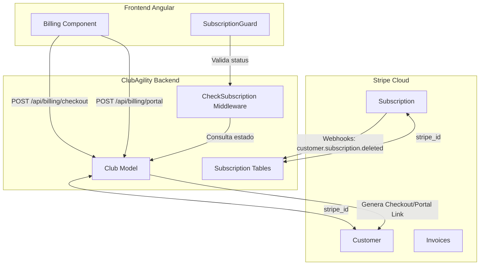

# Integración de Suscripciones SaaS con Stripe

Este documento detalla el diseño técnico, la arquitectura de integración y las guías de resolución de problemas para gestionar y controlar las suscripciones de los clubes a la plataforma **ClubAgility** utilizando la pasarela de pagos **Stripe** y la librería oficial **Laravel Cashier** en el backend.

---

## 1. Arquitectura General y Entidad Facturable

En la arquitectura *Single Database, Multi-Tenant* de ClubAgility, la unidad operativa y aislada es el **Club** ([Club](file:///c:/Users/Usuario/Desktop/AgilityAsturiass/agility_back/app/Models/Club.php)). Por lo tanto, la facturación y el estado de la suscripción se asocian directamente al Club, y no a los usuarios individuales.

*   **Billable Entity:** El modelo `Club` actúa como el cliente facturable en Stripe.
*   **Gestor del Pago:** El usuario con rol `manager` (Responsable del Club) es el encargado de dar de alta el club, configurar el método de pago y gestionar las facturas.
*   **Herramienta de Control:** Se utiliza **Laravel Cashier (Stripe)** para automatizar la sincronización de suscripciones, métodos de pago, cobros y webhooks.
*   **Modelo de Pago Inmediato:** No se ofrecen periodos de prueba gratuitos. El acceso de los clubes está condicionado a la existencia de una suscripción activa de pago desde el registro inicial.



---

## 2. Modelo de Datos y Migraciones (Backend)

Para habilitar Laravel Cashier en el modelo `Club`, se deben añadir las columnas de Stripe y crear las tablas de soporte de suscripción.

### A. Modificación de la Tabla `clubs` (Tenant)
Se agregan los campos necesarios para asociar el club con su correspondiente perfil de cliente en Stripe:

```php
Schema::table('clubs', function (Blueprint $table) {
    $table->string('stripe_id')->nullable()->index();
    $table->string('pm_type')->nullable();
    $table->string('pm_last_four', 4)->nullable();
});
```

### B. Tablas de Laravel Cashier
Se añaden las tablas estándar de Cashier para controlar el estado de las suscripciones a nivel de base de datos:

*   **`subscriptions`**: Registra la suscripción del club, su estado actual y el plan (precio de Stripe) asignado.
*   **`subscription_items`**: Permite asociar múltiples productos/precios a una sola suscripción.

### C. Configuración del Modelo `Club.php`
Se integra el trait `Billable` de Cashier en el modelo y se configura el modelo de cliente en `AppServiceProvider.php` usando `Cashier::useCustomerModel(Club::class)`:

```php
namespace App\Models;

use Illuminate\Database\Eloquent\Model;
use Laravel\Cashier\Billable;

class Club extends Model
{
    use Billable;

    protected $fillable = [
        'name',
        'slug',
        'domain',
        'logo_url',
        'settings',
        'settings_ranking',
        'plan_id',
        // Stripe fields
        'stripe_id',
        'pm_type',
        'pm_last_four',
    ];
    
    // ...
}
```

---

## 3. Ciclo de Vida del Tenant: Registro y Pago Obligatorio

Para asegurar la viabilidad comercial y el filtrado de registros inactivos, el onboarding requiere el registro de un método de pago y suscripción inmediata:

1.  **Registro Inicial:** El gestor del club rellena el formulario de solicitud en la web comercial principal (`join-saas`).
2.  **Creación de Cuenta Inactiva:** El backend crea la cuenta del club en la base de datos local y un usuario con rol `manager` (Gestor del club).
3.  **Redirección a Stripe Checkout:** En lugar de forzar al usuario a entrar al panel para realizar el pago, al hacer clic en **Completar Solicitud** se genera una sesión de Stripe Checkout en el backend ([ClubLeadController.php](file:///c:/Users/Usuario/Desktop/AgilityAsturiass/agility_back/app/Http/Controllers/ClubLeadController.php)) y se redirige al usuario de manera inmediata a la pasarela segura de Stripe.
4.  **Retorno y Aprovisionamiento Seguro:** Tras realizar el pago con éxito, Stripe redirige al usuario a la landing comercial principal con los parámetros `stripe_success=true` y el `slug` del club. Esto dispara de manera segura la animación del flujo de aprovisionamiento de la base de datos de tenant, configuración de Nginx y generación de certificados SSL mediante Let's Encrypt.
5.  **Confirmación y Activación:** Una vez completado el pago, el backend recibe el webhook `checkout.session.completed` de Stripe y activa la suscripción en la base de datos. El club queda disponible para su uso de forma inmediata.

---

## 4. Flujo de Pago y Redirección a Stripe Checkout (Descuentos de Lanzamiento)

La aplicación ofrece tres planes de suscripción. El **Plan Pro** incluye un descuento automático de lanzamiento durante los dos primeros meses:

*   **Plan Básico:** 29 € / mes (Precio Stripe: `STRIPE_PRICE_BASICO`).
*   **Plan Pro (Recomendado):** 49 € / mes (Precio Stripe: `STRIPE_PRICE_PRO` con el cupón `STRIPE_COUPON_PRO_LAUNCH`, que rebaja la cuota a **19 € / mes durante los primeros 2 meses**).
*   **Plan Élite:** 79 € / mes (Precio Stripe: `STRIPE_PRICE_ELITE`).

### Lógica del Checkout en Backend (`POST /api/billing/checkout`):

Se encuentra definida en [BillingController.php](file:///c:/Users/Usuario/Desktop/AgilityAsturiass/agility_back/app/Http/Controllers/BillingController.php):

```php
public function checkout(Request $request)
{
    $user = $request->user();
    if ($user->role !== 'manager' && $user->role !== 'admin') {
        return response()->json(['message' => 'No autorizado.'], 403);
    }

    $club = app()->bound('active_club_id') ? Club::find(app('active_club_id')) : $user->club;

    $validated = $request->validate([
        'plan_slug' => 'required|string|in:basico,profesional,elite',
    ]);

    $planSlug = $validated['plan_slug'];
    $priceId = match ($planSlug) {
        'basico' => env('STRIPE_PRICE_BASICO'),
        'profesional' => env('STRIPE_PRICE_PRO'),
        'elite' => env('STRIPE_PRICE_ELITE'),
    };

    $subscription = $club->newSubscription('default', $priceId);

    if ($planSlug === 'profesional') {
        $couponId = env('STRIPE_COUPON_PRO_LAUNCH');
        if ($couponId) {
            $subscription->withCoupon($couponId);
        }
    }

    $host = $request->getHost();
    $scheme = $request->secure() ? 'https' : 'http';
    $successUrl = "{$scheme}://{$host}/configuracion/facturacion?success=true&session_id={CHECKOUT_SESSION_ID}";
    $cancelUrl = "{$scheme}://{$host}/configuracion/facturacion?cancel=true";

    $checkoutSession = $subscription->checkout([
        'success_url' => $successUrl,
        'cancel_url' => $cancelUrl,
    ]);

    return response()->json(['url' => $checkoutSession->url]);
}
```

---

## 5. Portal de Facturación Autogestionado (Stripe Customer Portal) e Invoices

La gestión de tarjetas, cambios de plan y descargas de facturas se delega al **Stripe Customer Portal** y a endpoints específicos del backend.

*   **Acceso:** En la sección de Configuración > Facturación del club, el gestor dispone del botón **Gestionar en Stripe**.
*   **Generación del Enlace:** El backend expone el endpoint `POST /api/billing/portal` que devuelve una URL temporal y firmada del portal de Stripe.
*   **Historial de Facturas:** La vista de facturación carga el listado de facturas consultando a `GET /api/billing/invoices`.
    > [!IMPORTANT]
    > **Resolución de Errores de Invoices (500 Error):**
    > Anteriormente, el formateo del total de la factura realizaba operaciones matemáticas sobre un string con formato de moneda, lo cual fallaba. Ahora se retorna `$invoice->total()` directamente de Laravel Cashier para evitar errores de parseo de moneda en el backend.
*   **Descarga de Facturas:** Para descargar una factura, el frontend abre en una pestaña nueva la dirección del endpoint `/api/billing/invoices/{invoice}/download`.
    > [!IMPORTANT]
    > **Firma del Endpoint de Descarga:**
    > La firma del método en [BillingController.php](file:///c:/Users/Usuario/Desktop/AgilityAsturiass/agility_back/app/Http/Controllers/BillingController.php#L190) se simplificó a `downloadInvoice(Request $request, $invoice)` para asegurar que el parámetro coincida de manera exacta con el marcador `{invoice}` de la ruta `/api/billing/invoices/{invoice}/download` definida en `api.php`. Esto evita errores de inyección y de coincidencia de parámetros en Laravel.

---

## 6. Control de Acceso y Middleware de Bloqueo

El middleware de protección [CheckSubscriptionActive.php](file:///c:/Users/Usuario/Desktop/AgilityAsturiass/agility_back/app/Http/Middleware/CheckSubscriptionActive.php) verifica estrictamente la existencia de una suscripción activa.

### Lógica del Middleware:
Este middleware intercepta las peticiones de todos los usuarios pertenecientes al club (excepto rutas públicas y endpoints exentos):

```php
namespace App\Http\Middleware;

use Closure;
use Illuminate\Http\Request;
use App\Models\Club;

class CheckSubscriptionActive
{
    public function handle(Request $request, Closure $next)
    {
        $club = app()->bound('active_club_id') ? Club::find(app('active_club_id')) : null;
        if (!$club && $request->user()) {
            $club = $request->user()->club;
        }

        // Si no hay club (consola/seeder) o el usuario es admin global, permitir libre acceso
        if (!$club || ($request->user() && $request->user()->role === 'admin')) {
            return $next($request);
        }

        // Verificar si el club tiene la suscripción activa
        if ($club->subscribed('default')) {
            return $next($request);
        }

        // Si la suscripción no está activa:
        if ($request->user()) {
            if ($request->user()->role === 'manager') {
                // El Gestor puede acceder únicamente a endpoints de facturación, info de club, sesión o usuario
                if ($request->is('api/billing/*') || $request->is('api/tenant/info') || $request->is('api/logout') || $request->is('api/user')) {
                    return $next($request);
                }

                return response()->json([
                    'error' => 'subscription_expired',
                    'message' => 'La suscripción del club ha expirado. Por favor, realiza el pago para reactivar el servicio.'
                ], 402);
            }
        }

        // Socios y Staff son bloqueados con 403 Forbidden en cualquier petición privada
        return response()->json([
            'error' => 'club_suspended',
            'message' => 'El acceso a la aplicación de este club está temporalmente suspendido.'
        ], 403);
    }
}
```

---

## 7. Sincronización y Pruebas con Webhooks de Stripe

Los webhooks permiten recibir notificaciones de eventos ocurridos en Stripe para actualizar la base de datos de forma asíncrona.

*   **Ruta local del Webhook:** `/api/webhooks/stripe`.
*   **Pruebas en Entorno Local (Laravel Herd):** Como Herd sirve la aplicación en puerto 80 a través de Nginx (`http://agility_back.test`), la herramienta Stripe CLI debe configurarse para redirigir los eventos a ese dominio virtual y no al puerto por defecto 8000.
    > [!IMPORTANT]
    > **Prefijo HTTP Obligatorio:**
    > Al configurar el comando de reenvío de webhooks localmente, debes especificar la URL completa incluyendo el esquema `http://`. De lo contrario, Stripe CLI fallará o ignorará el envío:
    > ```bash
    > stripe listen --forward-to http://agility_back.test/api/webhooks/stripe
    > ```
*   **Firma del Secreto:** El valor de `STRIPE_WEBHOOK_SECRET` impreso al iniciar `stripe listen` (con formato `whsec_...`) debe copiarse fielmente al archivo `.env` del backend para validar y procesar las firmas de los webhooks entrantes.

---

## 8. Interfaz de Usuario y Guards (Frontend Angular)

### A. Guards de Ruta y Contexto de Inyección (toObservable)
En Angular 18+, los guards asíncronos (`async/await`) pierden el contexto de inyección tras un `await`. Para evitar errores `NG0203` al usar `toObservable()`, los guards (como [subscription-active.guard.ts](file:///c:/Users/Usuario/Desktop/AgilityAsturiass/frontend/src/app/guards/subscription-active.guard.ts)) capturan el `Injector` síncronamente al inicio del método y lo pasan explícitamente como opción al transformar señales a observables:
```typescript
const injector = inject(Injector);

// Esperar a que cargue la autenticación si está en proceso
if (authService.checkAuthLoading()) {
    await firstValueFrom(
        toObservable(authService.checkAuthLoading, { injector }).pipe(
            filter(loading => !loading)
        )
    );
}
```

### B. Mitigación de Errores 402 en la Consola
Para evitar que se realicen llamadas HTTP innecesarias que resulten en errores molestos de tipo `402 (Payment Required)` en la consola del navegador cuando el club está bloqueado, los servicios de frontend (tales como [DogService](file:///c:/Users/Usuario/Desktop/AgilityAsturiass/frontend/src/app/services/dog.service.ts), [NotificationService](file:///c:/Users/Usuario/Desktop/AgilityAsturiass/frontend/src/app/services/notification.service.ts) y [OnboardingService](file:///c:/Users/Usuario/Desktop/AgilityAsturiass/frontend/src/app/services/onboarding.ts)) inyectan `TenantService` y cancelan preventivamente sus peticiones si la suscripción está inactiva:
```typescript
if (this.tenantService.tenantInfo()?.subscribed === false) {
    return; // Cancela la petición antes de realizar la llamada HTTP
}
```

### C. Protección de la Ruta Raíz
La ruta raíz `/` (asociada al `HomeComponent` del subdominio) incluye el guard `subscriptionActiveGuard`. Esto asegura que los usuarios de clubes suspendidos no puedan permanecer en la página de bienvenida y sean redirigidos de inmediato a la sección de facturación (si son Gestores) o a la pantalla de suspensión de servicio (`/suscripcion-suspendida`) en caso de socios o entrenadores.

---

## 9. Solución de Problemas y Guía de Desarrollo Local (FAQ & Troubleshooting)

### P: El pago en Stripe simulado fue correcto, pero al loguearme me sigue saliendo "Se requiere una suscripción activa". ¿Qué pasa?
**R:** Esto se debe casi con total seguridad a que el backend local no está recibiendo los webhooks de Stripe. En desarrollo local, Stripe no puede conectarse a tu máquina directamente. Tienes que arrancar la utilidad Stripe CLI:
1.  Asegúrate de tener Stripe CLI instalado.
2.  Ejecuta: `stripe listen --forward-to http://agility_back.test/api/webhooks/stripe`
3.  Copia el secreto devuelto (`whsec_...`) en tu `.env` bajo `STRIPE_WEBHOOK_SECRET`.
4.  Realiza de nuevo una simulación de registro y pago, o provoca un cobro exitoso ficticio con `stripe trigger checkout.session.completed`.

### P: ¿Cómo puedo simular o activar manualmente la suscripción de un Club localmente sin usar Webhooks?
**R:** Si no tienes conexión a internet o quieres saltarte la verificación de Stripe de forma manual para probar otras partes de la aplicación, puedes simular la suscripción activa ejecutando la siguiente línea de código en **Tinker** (`php artisan tinker`) o en un script de desarrollo:

```php
$club = \App\Models\Club::where('slug', 'asturias-test')->first();
$club->subscriptions()->create([
    'type' => 'default',
    'stripe_id' => 'sub_mock_' . uniqid(),
    'stripe_status' => 'active',
    'stripe_price' => env('STRIPE_PRICE_PRO'),
    'quantity' => 1,
]);
```
Esto creará un registro de suscripción ficticio de estado `active` asociado al club, desbloqueando inmediatamente todos sus endpoints protegidos.

### P: Tengo errores del tipo "NG0203: toObservable() can only be used within an injection context..." al navegar por las páginas.
**R:** Este error ocurre en Angular cuando intentas utilizar la reactividad de señales a observables (`toObservable`) después de realizar operaciones asíncronas (`await`). Asegúrate de que los guards de tu ruta sigan el patrón de inyección síncrona del `Injector` al inicio del guard y lo pasen explícitamente como opción al observable, tal y como se detalla en la **Sección 8.A** de este documento.
