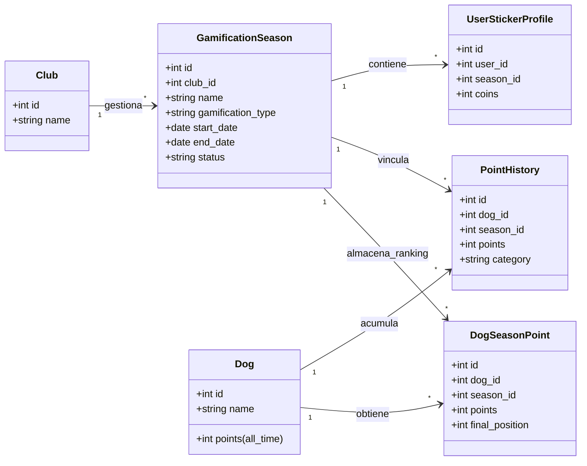

# 🧭 Análisis y Plan de Migración: Gamificación por Temporadas

Este documento analiza los cambios estructurales, técnicos y lógicos necesarios para transformar el sistema de gamificación actual de **ClubAgility** (un único ranking global continuo) en un **sistema rotativo por temporadas independientes**.

---

## 🎯 Requisitos Clave
1. **Rotación:** Poder alternar los módulos de gamificación (ej. `Ranking de perros` y `Álbum de Stickers`) por temporadas (ej. de 6 meses).
2. **Independencia:** Cada temporada de un módulo debe empezar desde cero (puntos reseteados, álbum vacío).
3. **Histórico:** Al finalizar una temporada, sus resultados finales (ej. clasificación final del ranking, stickers completados) deben quedar congelados y consultables en el futuro.
4. **Administración:** Panel de control para que los administradores puedan finalizar la temporada actual e iniciar una nueva, seleccionando qué módulo se aplicará.
5. **Multi-tenant:** La gestión de temporadas debe estar aislada por club.

---

## 💾 Cambios en el Modelo de Datos (Base de Datos)

Para aislar los datos por temporada sin perder el histórico, se propone el siguiente esquema:



### 1. Nueva Tabla: `gamification_seasons`
Almacena el registro de cada temporada por club.
* `id` (PK)
* `club_id` (FK a `clubs` - garantiza el aislamiento multi-tenant)
* `name` (string - ej. "Temporada Primavera 2026")
* `gamification_type` (enum - `ranking`, `stickers`)
* `start_date` (date)
* `end_date` (date, nullable - se rellena al finalizarla)
* `status` (enum - `active`, `finished`)
* `timestamps`
* *Restricción*: Solo puede existir una temporada con `status = 'active'` por cada `club_id` a la vez.

### 2. Nueva Tabla: `dog_season_points`
Almacena la puntuación y clasificación de cada perro en una temporada específica de tipo `ranking`.
* `id` (PK)
* `dog_id` (FK a `dogs`)
* `season_id` (FK a `gamification_seasons`)
* `points` (integer, default: 0) - puntos acumulados exclusivamente en esa temporada.
* `final_position` (integer, nullable) - posición final del perro al congelar la temporada.
* `timestamps`
* *Índice único*: `[dog_id, season_id]`

### 3. Modificación en `point_histories`
* Añadir columna `season_id` (FK a `gamification_seasons`, nullable) para poder filtrar el desglose de transacciones de puntos por temporada.

### 4. Modelo de Stickers existente
* La tabla propuesta `user_sticker_profiles` ya incluye `season_id`, lo cual es correcto y permite aislar el progreso del álbum de cromos y monedas por cada ciclo en que se active dicho módulo.

---

## ⚙️ Cambios en el Backend (Laravel API)

### 1. Lógica de Asignación de Puntos
En lugar de incrementar directamente `dogs.points` en los controladores de asistencia y puntos extra, el backend debe:
1. Buscar la temporada activa del club: 
   ```php
   $activeSeason = GamificationSeason::where('club_id', $clubId)
       ->where('status', 'active')
       ->first();
   ```
2. Si la temporada activa es de tipo `ranking`:
   - Crear o actualizar el registro en `dog_season_points` para el perro y la temporada correspondiente, incrementando su puntuación.
   - Guardar el registro en `point_histories` asociando la `season_id`.
   - *(Opcional)* Incrementar `dogs.points` únicamente a modo de "Puntuación Histórica Acumulada de por vida", pero no usarla para la clasificación de la temporada.
3. Si la temporada activa es de tipo `stickers`:
   - No se alteran los puntos del ranking. Las acciones de asistencia o vídeos otorgan cofres/monedas al perfil de stickers del usuario de la temporada actual (`user_sticker_profiles`).

### 2. Endpoints del Ranking
* **`GET /api/ranking`**:
  - Por defecto, obtiene la temporada activa de tipo `ranking` del club y devuelve la clasificación basada en `dog_season_points`.
  - Acepta un parámetro opcional `?season_id=X` para consultar rankings archivados. Si la temporada consultada está finalizada, devuelve los datos ordenados con su `final_position` guardada.

### 3. Gestión de Ciclo de Vida (Season API)
Nuevo controlador `SeasonController` con rutas exclusivas para directiva/administradores:
* **`POST /api/seasons/start`**:
  - Valida que el nombre sea único y el tipo sea correcto (`ranking` o `stickers`).
  - Si hay otra temporada activa en el club, llama internamente al proceso de finalización antes de iniciar la nueva.
  - Crea el nuevo registro en estado `active`.
* **`POST /api/seasons/end`**:
  - Marca la temporada activa como `finished` y establece `end_date = now()`.
  - Si la temporada finalizada era de tipo `ranking`, ejecuta una transacción que calcula las posiciones finales de todos los perros participantes y las guarda en `dog_season_points.final_position`.

---

## 🎨 Cambios en el Frontend (Angular UI)

### 1. Panel de Administración (Staff/Admin)
Crear una pestaña de **"Gestión de Temporadas"** dentro de los ajustes del club:
* **Estado Actual:** Muestra la temporada activa, fecha de inicio y el módulo de juego actual.
* **Acción de Cierre:** Botón para "Finalizar Temporada" con confirmación y previsualización del podio o progreso actual.
* **Acción de Apertura:** Formulario para "Iniciar Nueva Temporada" con:
  - Campo de texto para el Nombre.
  - Selector de Módulo Activo (con explicaciones de cada dinámica).
  - Fecha de inicio.

### 2. Vista de Socios (Ranking / Álbum)
* **Visualización Dinámica:** La aplicación adaptará su menú y pantallas principales según la temporada activa del club:
  - Si la temporada es de **Stickers**, el botón "Colección" será visible en el menú principal y el "Ranking" se mostrará secundario o histórico.
  - Si la temporada es de **Ranking**, la tabla de posiciones ocupará el protagonismo del dashboard deportivo.
* **Selector de Histórico:** En la pantalla del ranking, se añadirá un menú desplegable (dropdown) que permita cambiar de la "Temporada Activa" a cualquier temporada anterior archivada para consultar quién ganó o ver el podio histórico.

---

## 🔄 Plan de Migración de Datos (Cold Start)

Para evitar la pérdida de datos del ranking actual durante el despliegue de esta actualización:
1. **Creación de Temporada Cero:** Mediante una migración de base de datos o *seeder*, crear una temporada inicial llamada "Temporada Fundacional (Pre-estacional)" con `gamification_type = 'ranking'`, `status = 'finished'`, y con la fecha de inicio del club.
2. **Traspaso de Puntos:** Migrar la puntuación actual de `dogs.points` a la tabla `dog_season_points` vinculada a esta Temporada Cero.
3. **Actualización de Historial:** Vincular todos los registros actuales de `point_histories` al `id` de esta Temporada Cero.
4. **Inicio de Nueva Temporada:** Iniciar la primera temporada oficial del club en estado activo.
